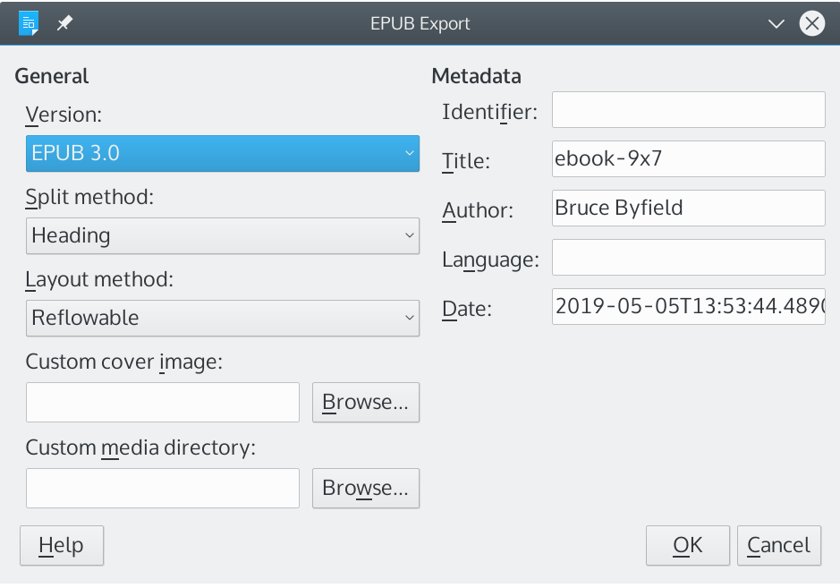
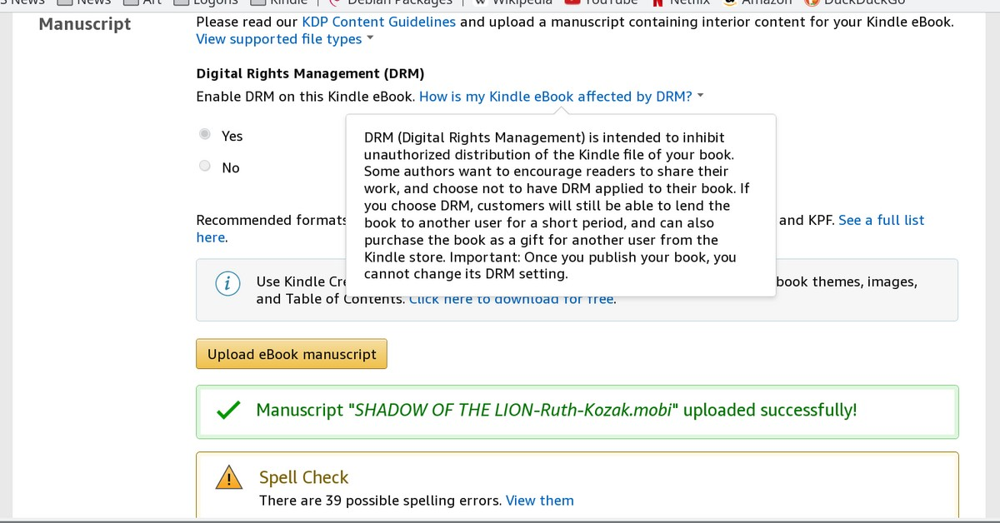

# 利用自由软件设计电子书

Bruce Byfield 著

## 0.1 著作权

此文档著作权 (C) 2020 为 Bruce Byfield 所有，基于知识共享：署名——相同方式分享许可证 3.0 或更高版本：<https://creativecommons.org/licenses/by-sa/3.0/>

LibreOffice 是文档基金会的商标：<https://documentfoundation.org/>。本书中的所有其他商标属于其各自的持有人。

## 0.2 编辑和出版者

Jean Hollis Weber, 544/60 North Beck Drive, Condon, Queensland, 4815, Australia

电子邮件：publisher@designingebooks.com

## 0.3 出版日期和软件版本

本书出版于 2020 年一月 31 日，基于 LibreOffice 6.4 及更高版本。

ISBN 978-1-921320-58-3（纸版）

本书的 ODT、PDF、EPUB 和 ~~MOBI~~ 版本可以从该网站自由下载：<https://designingebooks.com/>

## 0.4 图片来源

封面图片著作权为 Bruce Byfield 所有，基于知识共享：署名——相同方式分享许可证 3.0 或更高版本发布。

# 第一章 简介

电子书是出版界的一个主要类别。在 2017 年，仅在美国就有 2 亿 6600 多万份电子书被出版，带来了 3 亿 5000 多万美元的销售额。这些年来的这一数字和销售额有所起伏，但显而易见的是，电子书的出版保持稳定。

电子书的流行的大部分原因在于自出版的崛起。在今天，任何拥有一台计算机的人都可以编写一部书籍并在诸如 ~~Amazon~~ 等网站上进行推广，而有很多人渴望利用这种出版的便利。

然而，还缺少一件事情：生产您自己的电子书的能力。任何电子书格式都不复杂，基于和网页所使用的相同的超文本标记语言（HTML），然而对于很多人来说，生产一部电子书仍然显得神秘。尽管网上有指导方法，这一过程并不令很多作家感到舒适。很多人最终面临为电子书的生产付费，而如果某些地方发生错误，他们不能自行修复这些问题。

本书的编写是为了揭开电子书生产的神秘。只要有了 LibreOffice 和 Calibre 这两种可以自由下载的应用软件的帮助，您就可以生产您自己的电子书而无需额外付费。

本书解释了这些应用软件可用于生产电子书的若干不同方式，而这些方式很可能就是您所应该选择的。本书的目标是揭开电子书的神秘，并且教会自出版者如何获得生产的控制权。

## 1.1 理解电子书格式

电子书倾向于以三种格式之一出版。第一种也是最古老的格式是 PDF，这是一种由 Adobe Systems 开发的格式。早在其他格式出现之前，PDF 曾经是在线出版的首选格式。它仍然是一种备选格式，如果所需要的不仅仅是一连串段落。PDF 的优势是它同 PostScript 相似，后者是用于将文件从计算机发送至打印机的语言之一，因此，它适合于复杂布局，或者被用户用于打印他们自己的副本。

第二种格式是 EPUB，一种广泛使用的开放标准。不论您是直接从 LibreOffice 生产您的电子书，还是将其导入至 Calibre 进行编辑，您将会使用 EPUB 文件，即使您的目标是准备一部其他格式的电子书。EPUB 是一种通用的标准，它对于在不同的应用软件之间进行通讯十分有用。

第三种格式是 ~~MOBI~~，其修改过的形式用于 ~~Amazon Kindle~~。通过 Calibre，您可以轻松地将 EPUB 文件转换为 ~~MOBI~~，由于二者都是基于 HTML，并且都利用层叠样式表（CSS）进行格式化。其他格式也可转换自 EPUB，尽管它们在此不会被提到，由于这一过程类似于转换为 ~~MOBI~~。

## 1.2 下载基本工具

众多工具可用于处理电子书。本书作者选择了 LibreOffice 和 Calibre，既由于它们的品质，也由于它们开放源代码这一事实。“开放源代码”意味着这些应用软件可以自由下载，并且可以被安装到您所希望的任意多台计算机上。

LibreOffice 是微软 Office 的替代品。LibreOffice 的文字处理器 Writer 高度基于样式，这使得将它的文件转换为 EPUB 更为容易。LibreOffice 可用于 GNU/Linux、macOS 和 Windows，它可以从此处下载：<https://www.libreoffice.org/download/download/>。

Calibre 最为著名的是作为一种电子书管理器。通过利用 Calibre，您可以阅读电子书、将它们传输到电子书阅读器，以及在线查找其他电子书。

不那么广为人知的是这样一件事，即 Calibre 包含了您设计电子书所需要的全部工具，甚至包括用于作为最终方案的手动修改的编辑器。您可以从这里下载用于 GNU/Linux、macOS 或者 Windows 的 Calibre：<https://calibre-ebook.com/download>。

这两个下载页面都提供安装指示。

## 1.3 概述

当您生产一部电子书时，您有若干种选择：

1. 在 LibreOffice Writer 中格式化并编写原始文档
2. 进行以下操作之一
    * 对于简单文档，从 LibreOffice 中导出为 EPUB
    * 对于大多数文档，将 EPUB 导出至 Calibre
    * 对于复杂布局，导出为 PDF
    * 在 Calibre 中编辑 EPUB
3. 如有必要，手动编辑 CSS 代码

本书的其余部分详细叙述了所有这些操作。

> 图：利用开放源代码的工具创建电子书的步骤

# 第二章 构建源文档

生产一部电子书的最佳方式是手动输入 CSS 代码。通过这种方式，您的文档将会准确地如同您所计划的那样。然而，众多作家对于这一选项并不感到舒适，这使得 LibreOffice Writer 成为一种合理的折衷。

Writer 拥有作为一种文字处理器的优势，这是一类大多数将要成为作家的人们已经熟悉的工具。确实，很多人可能对于 Writer 并不熟悉，然而如果他们曾经使用过微软 Word，则 LibreOffice 应该易于学习。更进一步地，Writer 比微软 Word 更加稳定，而且处理大文件的能力明显强于后者。

然而，LibreOffice Writer 最重要的特性是它高度依赖样式。样式是那些可以被一次性创建，随后按需应用的格式化选项的集合。如果您想要更改格式，您可以在样式中进行更改，而整篇文档将会在几秒钟之内更新。使用样式不仅可以节约时间，而且它们与电子书中的 HTML 标签类似，这有助于平滑地导出为 EPUB。基于这些原因，作家们应该首先熟悉段落样式和字符样式，再开始写作。

用于页面、框架、列表和表格的其他 Writer 样式在此并不相关，由于 EPUB 格式并不支持它们的 Writer 版本。而 Writer 的文本框、制表符或者交叉引用等工具也不被支持。如果您离不开这些项目，您需要使用某种变通方法，或者在该文本被传送至 Calibre 之后添加特性，自行输入 CSS 代码。

同样需要注意的是，尽管您可能会合乎逻辑地假设生成 HTML 将会使得转换为 EPUB 更加容易，然而实际上，HTML 并不能带来什么好处。因此，您可以仍然使用 LibreOffice Writer 默认的，对于人类更加友好的开放文档格式（Open Document Format，ODF）。

一般来说，用于转换为电子书的写作的基本规则应当是：保持其简洁。所使用的字符样式和段落样式越少，发生错误的可能性就越小，并且您不得不在 Calibre 中进行的编辑就越少。对于更加复杂的文档，该 LibreOffice 文件可以作为电子书成品的实体模型。

如果遵循这些建议，您的电子书生产过程应该不会遇到什么麻烦。如果您正在为他人生产电子书，试着让他们也遵循本章中的指导意见，否则这一过程可能会变得困难。

如果本章的建议显得过于精细，请记住，这些建议的本意是使得这一过程尽可能少地遇到麻烦。

## 2.1 为某个特定网站进行写作

在您开始投入任何时间进行写作之前，检查您所计划投稿的任何网站以获知任何关于格式的指示。众多电子书网站将会拒绝任何并未准确地按照它们的规范格式化的内容。这主要是为了使得该网站的所有电子书拥有一致的外观。通常，这些规则是完全随意的，就这个意义而言，您可以编写一部格式恰当得体的电子书，但不满足它们的要求。

不可否认的是，这些变体可能会成为一种麻烦，如果您向多于一家网站投稿，并且需要更改格式。然而不幸的是，您的选择被限制为遵循这些规范，或者不与依赖这些规范的网站打交道。而如果您使用样式，则生产一篇文档的不同版本的问题至少将会变得尽可能简单与快捷。

## 2.2 利用样式进行工作

如果您从未使用过样式，这里是一段快速介绍。

样式是一组格式化选择的集合。例如，一种典型的段落样式将会设置诸如字体、首行缩进、行间距等。如果您想要在某个段落中作出与主要格式不同的选择，您需要使用字符样式来格式化该段落的一部分。

> 图：段落样式和字符样式

使用样式的优势在于，您可以只进行一次格式化，而非在您每次需要它的时候都进行格式化。鉴于在转换为 EPUB 之后得到正确的格式这件事有时会涉及大量试错，使用样式，尤其是段落样式，可以节省相当可观的时间。更改某种样式的细节所需的击键次数几乎相当于更改某处手动格式化的实例，而哪怕只是一份简短的文件也可能拥有数百处这样的实例。

在您编辑一部电子书时，曾经使用过样式也可节省您的时间和精力。例如，本书作者于近期为某位作家创建了一部电子书，此人使用制表符来缩进每个段落的首行。这些制表符在 EPUB 转换过程中消失了。该电子书的源文件超过 1500 页，因此手动重新创建这些缩进将会需要数小时。然而，由于源文件只用到了一种段落样式，本书作者可以通过为该段落样式的首行添加自动缩进来修复这一问题，而这一特性在 EPUB 转换中得以保留。添加自动缩进所花费的时间是多少？少于两分钟。

除了段落样式和字符样式以外，Writer 还支持用于页面、框架、列表和表格的样式。出于您的便利，您可能想要使用这些样式中的一部分，尤其是当您计划将其转换为 PDF 格式时，它可以毫无困难地保留这些样式中的所有设定。

然而，EPUB 格式并不支持它们的 Writer 版本，也不能支持 Writer 的文本框、制表符，或者交叉引用等工具。如果您离不开这些特性，您要么需要使用第三章提到的变通方法之一，要么在该文件被传送至 Calibre 之后再添加特性；参见第七章。

您可能会合乎逻辑地假设，仅使用对于 HTML 友好的样式可以使得转换为 EPUB 更加容易，由于 EPUB 文件基本上是修改过的 HTML 文件。然而实际上 HTML 并不会带来什么好处。因此，您可以仍然使用 LibreOffice Writer 默认的，对于人类更加友好的 ODF 格式。由于 ODF 是开放源代码的，Calibre 在处理它们的时候不会遇到任何问题。

## 2.3 应用样式

如需使用样式，您需要打开侧边栏中的“样式和格式”（Styles and Formatting）窗口。进行下列操作之一：

* 从菜单栏选择“样式”/“管理样式”
* 按下 F11 键
* 在“格式”工具栏中的“设置段落样式”列表中点击“更多样式”
* 选择侧边栏中的“样式”按钮

> 图：Writer 中的“样式和格式”窗口

此窗口工具栏的左上方是用于选择您想要列出的样式的类别的图标。将鼠标指针悬浮在某个图标上方以查看其样式类别。对于制作一部电子书而言，您只需使用左边前两个，即段落和字符。此样式列表将会高亮显示光标所在位置的样式。

如需应用一种段落样式，将光标置于您希望格式化的段落中的任意位置。如需应用一种字符样式，选中需要格式化的文本。然后无论哪种情况，点击该样式以将其应用。

如需修改一种样式或者基于它创建一种新样式，在右键上下文菜单中进行选择。

在“样式和格式”窗口底部是一个用于过滤这些样式的下拉列表。在您输入了一两页文本以后，将显示的内容改为“已应用的样式”（Applied Styles）将会为您显示一个小范围的列表以便于从中进行选择。

## 2.4 使用样式窗口

在整个 LibreOffice 中，用于每一种样式的窗口被划分为若干选项卡。

在所有选项卡之中，最为重要的是“组织”（Organizer）选项卡。它总结了该样式同其他样式之间的关系。它有四个字段：

* “名称”：在“样式和格式”窗口中的项目
* “下一样式”：当您按下 Enter 键之后将会使用的样式
* “继承自”：其格式作为当前样式的基础的样式
* “类别”：包含该样式的列表视图

此外，“组织”选项卡还总结了为该样式选择的格式化选项。

> 图：用于“正文”段落样式的窗口

## 2.5 创建和修改样式

LibreOffice 拥有用于最为平常的目的的样式，因此一种节省时间的方法是仅使用预定义的样式，而仅更改必须更改的属性。总体而言，这些样式拥有智能的默认值，并且您在设计时通常只需进行少数修改。在制作一部电子书时，您甚至可以局限于预定义的样式，以使得源文件的创建过程尽可能简单。

## 2.6 创建基本模板

本书的 LibreOffice 文件可被用于创建模板，通过使用“文件”/“模板”/“另存为模板”来保存它。如果您仅在模板中进行格式更改，基于该模板的文件将会在您下次打开它的时候为您提供一次更新的机会。如果您选择不更新，则该文件同模板的关联将会断开。通常，您应该保持它同模板的关联。

> 图：在模板被修改之后更新文件

为了减少维护，本书作者建议您使用尽可能少的段落样式和字符样式。本电子书被设计为使用下列样式：

* “标题 1”（Heading 1）：用于章标题，在转换为 EPUB 过程中开始新页面
* “文本标题”（Text Heading）：一种标题样式，它不会在转换为 EPUB 过程中开始新页面
* “文本标题 2”（Text Heading 2）：一种副标题样式，它不会在转换为 EPUB 过程中开始新页面
* “正文”（Text Body）：用于文本的基本格式
* “项目编号列表”（Numbered List）：用于分论点的顺序重要时
* “项目符号列表”（Bullet List）：用于顺序不重要的列表

本书仅使用了三种字符样式：“强调”（Emphasis，斜体）、“互联网链接”（Internet Link）和“范例”（Example，等宽，用于代码）。

本书作者选择为标题和超链接使用一种颜色，尽管本书作者意识到众多读者将会改为使用他们自己的偏好。

> 图：用于本电子书的模板。为了使发生问题的几率最小化，它使用了最少的字符样式和段落样式

# 第三章 格式化源文件

对于大多数人来说，最容易进行格式化的地方是 LibreOffice Writer 源文件。如同本书后文所述，您还可以利用 Calibre 的编辑窗口进行格式化，甚至手动添加 CSS 代码——并且在某些情况下，您可能不得不如此做，以便准确地得到您所希望的效果。然而源文件通常是最为便捷的。

尽管如此，仍要时刻记住，并非 Writer 中可用的全部格式化都能被导出至 EPUB 格式。在这些限制中，有些可用变通方法绕过，其他的则可被添加到 CSS 中，如果您真的想要使用它们。

同样需要记住的是上一章结尾处所强调的事情：每当可能时，保持格式简单，并且使用段落样式和字符样式。

如果您确定样式不在您所愿意学习的东西之内，您应该能够知道如何利用 Writer 的菜单和工具栏进行手动格式化。然而如果您如此做，您正在使得这项工作变得更加困难，相对于它本应拥有的困难程度，尤其是当您在转换过程中遇到问题时。

本章的剩余部分根据一般任务而组织。每一节将会告知您可以做什么或者不能做什么，以及如何在 Writer 中进行每一项任务。

## 3.1 设计页面

不像 Writer，电子书并不使用“页面”这个概念。您可能已经注意到，当您阅读一部电子书时，页面底部显示的是您已经阅读的该文件的百分比，而非页数。

尽管如此，如果您的原始文件同样是为纸版设计的，您可能想要根据您的出版商关于页面尺寸和页边距等等的规范来格式化页面。您可以忽略页码，再将它们以及页脚或者页眉添加进来，仅仅将它们置于用于纸版的文件中。

> 图：页面样式对话框窗口

如需在 LibreOffice Writer 中格式化页面，按下 F11 以打开侧边栏中的“样式和格式”窗口。点击页面样式的列表并且编辑预定义的页面，或者通过右键点击此列表并且选择“新建”来设计您自己的页面。

着重关注“首页”（First Page）、“默认”（Default）、“左页”（Left Page）和“右页”（Right Page）这几种样式，它们很可能是您最常使用的。对于纸版书，通过使用“组织”选项卡中的“下一样式”字段，您可以轻松设置这样一种序列，首页样式后面跟着左页，其后跟着右页，再其后又跟着左页。对于电子书，您更有可能只需要首页和默认。不论是哪种方式，如果并未设置“下一样式”字段，您将不得不通过“插入”/“页面”或者利用“编辑”菜单手动添加分页符来更改页面样式。

## 3.2 选择字体

字体选择和格式化最好是在段落样式的“字体”和“字体效果”选项卡中进行。特别关注“正文”段落样式，它很可能是更经常使用的。一种补充性的字体可被用于标题和文章题目。

然而，除非您计划将其转换为 PDF 格式，无需过于专注于字体特征。确实，您可以在电子书中嵌入字体，但是如此做将会极大增加最终文件的大小，对于一部较长的书籍，其结果可能超过出版商所接受的大小。

更进一步地，如果该电子书文件将要在专用的电子书阅读器上，而非在一台计算机上阅读，众多读者将会选择他们所偏好的字体，从而抛开您所精心计算的效果。

如果您确实想要控制字体，您可以通过使用 CSS（参见第七章）来实现这种控制。然而，“字体效果”选项卡中的某些选项，诸如“闪烁”或者“浮雕”，在任何电子书格式中都不可用。

除非转换为 PDF 格式，您应该满足于诸如 ~~Times New Roman~~ 或者 ~~Helvetica~~ 等旧标准，或者诸如 ~~Calibri~~ 或者 ~~Cambria~~ 等新标准。

对于每一种样式，按下 F11 并点击左上方用于段落样式的按钮。查找名为“正文”和“标题 1”的段落样式，并且从“字体”选项卡中选择字体。使用“常规”（Regular，有时称之为“罗马体”，Roman）样式，对于正文，选择 10~12 点的字号，而任何标题样式不超过 18 点。读者也可以更改字号以适合他们自己的需求，但是这些选项通常带有一种合理且易于阅读的默认值。

> 图：段落样式的“字体”选项卡，同样的选项卡也被用于字符样式

您可能还想切换到字符样式的列表，并且将预定义的“强调”样式设置为正文字体的斜体版本，而将“着重强调”样式设置为粗体版本。这些样式将会覆盖某个段落对于选定字符的格式化。如果您用到了链接，您可能还需要一种“互联网链接”样式。

在每一种样式的窗口中，您还会注意到“字体效果”选项卡。字体颜色可能是“字体效果”选项卡中最常用的选项。然而，在大多数情况下，您可以保持此设定为“自动”，其默认值通常是黑色。还要记住，很多电子书阅读器和应用软件仅支持黑白模式，因此选择其他字体颜色可能是徒劳的。而更改字体颜色至多只能反映出您希望该电子书看起来是什么样子的理想方式。

> 图：用于段落样式和字符样式的“字体效果”选项卡

## 3.3 添加图像

图像包括诸如 PNG、GIF 和 JPEG 等标准格式的任何图形。而在 LibreOffice Draw 中制作的示意图或者绘图不能被导出。

如需添加一幅图像，选择“插入”/“图像”。

您可以在 Writer 中修改某些图像设定。例如，您可以剪裁图像以及调整图像大小。右键点击并选择“属性”以打开“图像”对话框。

所有图像，以及它们的对齐方式，还有在 Writer 中作出的任何调整大小，都会在转换过程中保留。而在 Writer 中作出的任何剪裁将会被丢弃，任何边框或者阴影也会被丢弃。

> 图：用于调整图像大小的对话框窗口

您可以在诸如 GIMP 等开放源代码的编辑器中编辑图像，它可用于 GNU/Linux、macOS 和 Windows，从这里下载：<https://www.gimp.org/downloads/>。

右键点击并选择“使用外部工具编辑”（Edit with External Tool）将会在您的计算机的默认图形编辑器中打开该图像。在完成外部图像编辑之后，选择“全选”，然后“复制”，再将其粘贴到 LibreOffice Writer 文件中。

所有图像都应该拥有至少 72 dpi 的分辨率以用于在线查看。而如果您希望人们能够从您的电子书进行印刷，则应使用至少 300 dpi。

Writer 的图注工具通常使得图注及其对应图像保持在一起，但是转换为电子书的过程可能会出错。出于简洁性的考虑，您可能倾向于使得该图注成为图像的一部分，但应确保使用与正文相同的字体和字号。

将图像（或者一幅图像加上它的图注）“作为字符”锚定到独立的段落之中可以使其可靠地转换。

使用“上方”（Above）和“下方”（Below）设定以辅助定位一幅图像。您可以使用文字环绕，但是一种比较简单的选择是完全不用文字环绕。如有必要，将空白包含在图像中，以使得该图像横跨页边之间的全部空间。

如果发生转换问题，您可能想要在图像属性的“选项”选项卡中添加一段替代文本。该替代文本将会显示在图像的位置，以告知读者所缺失的图像的内容。

随着您添加图像，记住在 EPUB 转换过程中，源文件中的首幅图像将会被设置为封面图像。尽管您可以在 Calibre 中更改封面图像，将其插入到源文件中可以在导出之后省去一步操作。在大多数情况下，首幅图像应该包括标题和作者。

## 3.4 使用表格

对于表格的 EPUB 转换容易发生错误，并且看起来取决于操作系统。至少是在某些情况下，只有表格中的文本会被转换，而没有边框。

如第七章所述，您可以利用 CSS 标签来手动创建表格，尽管这一过程是复杂的。作为替代，您也可以将表格创建为图像。一幅表格图像应该包含替代文本，输入于“图像”对话框窗口中的“选项”选项卡。不论何种情况，确保该图像使用与该文档本身的段落样式相同的字体和字号。

## 3.5 创建列表

大多数格式将会在自 LibreOffice 中导出之后丢失。如果列表对于您的作品十分重要，您应该使用 CSS。否则，您可以通过手动输入列表来解决，输入数字并且将项目编号作为特殊字符而添加。

如果项目顺序重要，则使用项目编号列表，如果不重要，则使用项目符号列表。例如，在向导中使用项目编号列表，而在杂项清单中使用项目符号列表。二者都只应使用于三个或者更多的项目。两个项目应该放置于普通文本中。

项目末尾的标点符号应自始至终保持一致。如果列表项目比较简短，您也可以选择不使用任何标点符号。

为了避免潜在的问题，不要使用图形项目符号。然而，您可以将任意特殊字符用作项目符号，如果您选择使用它。

如需使用特殊字符，点击“插入”/“特殊字符”，并且将您所选择的字符插入文本中。此方法将会转换为 EPUB 格式，但可能并非所有网站都会接受。同时，您将不能使得文本中的第二行对齐到该列表项目的第一行。与之相反，第二行将会始于项目编号或者项目符号的正下方。其结论是，如果使用此方法，保持列表项目的长度少于一行。

> 图：Writer 的特殊字符窗口。您可以使用最底行的左数第七个字符来手动插入项目符号

第二种选择是利用 CSS 添加列表。此方法拥有解决格式问题的优势。然而，如果您遵循某些出版商的格式规范，您也许不能使用 CSS 列表。

## 3.6 使用框架和分栏

框架和分栏将会在转换为 EPUB 的过程中被丢弃。大多数用户应该满足于并不要求这些特性的更加简单的设计。一幅图像可用于替代这些特性，使用与“正文”段落样式相同的字体和字号，而分栏也可以利用 CSS 来构建（参见第七章）。

一个部分例外是通过段落样式的“首字放大”选项卡创建的首字放大。在转换为 EPUB 的过程中，框架将会被丢弃，而首字放大则被保留。

## 3.7 设置段落定位

段落定位设定可以转换为 EPUB 而不会发生任何问题。在段落样式窗口中，有两个主要的选项卡包含定位设置。

“缩进和间隔”选项卡拥有用于缩进文本、段落上方和下方的空白，以及行间距的设定。此外，您还可以为新段落设置自动缩进，但是需要给出多于您认为所需的空白——输出结果可能会缩小缩进量。

> 图：段落样式的“缩进和间隔”选项卡

“对齐”选项卡用于设置一个段落如何座落在基线之上。很多人将会选择“两端对齐”，于是文字分布在每一行从左至右的全部空间上。

然而，两端对齐需要大量微调以得到正确的效果，而更改字号将会破坏全部努力。左对齐看起来几乎同样好，而且无需任何微调。

居中和右对齐可用于诸如宣传册等更加复杂的布局。如果您的电子书以文本为主，您可能完全无需使用居中或者右对齐。

您还可以选择前往“文字流”选项卡并添加分页符，以使得新的一章总是始于新页面。有时，您可能想要通过选择“插入”/“分页符”来添加手动分页符。例如，您可以使用分页符将内容目录和正文分隔开来。不要使用断词或者孤行、寡行控制，由于换行符可能会在转换为 EPUB 格式的过程中发生偏移。

> 图：段落样式的“对齐”选项卡

## 3.8 使用链接

互联网链接将会在导出后保留下来。如需添加链接，选中该文本，然后选择“插入”/“超链接”。

交叉引用不会在导出之后保留。作为替代，点击“插入”/“书签”。

## 3.9 创建内容目录

如果您使用了段落样式，您可以在 Writer 中快速创建内容目录（TOC）或者其他引用目录。将光标置于您想要放置该目录的位置，并且点击“插入”/“内容目录和索引”/“内容目录、索引或书目”。只要“类型”/“创建自”/“提纲”被选中，此目录将会通过文档中的所有标题样式自动创建。

> 图：内容目录对话框窗口

然而记住，电子书的一种选项是每当使用某种标题样式时就开始新的一页。此选项可能造成很短的页面，从而制造出一种您所不希望的外观。出于此目的，您可能想要以不同的名称创建一种新样式以用作标题。您可以通过选择“类型”/“添加样式”/“指认样式”来将这种新样式添加至 TOC，并且设置它的标题级别。在转换过程中，这种新样式不会在它每次被使用时开始新页面。

您可以在“项目”选项卡中组织 TOC 项目。在此选项卡的上方是一组关于项目结构的简单示意图。由于同纸版相比，电子书以不同的方式使用页面，因此在大多数情况下，您并不需要页码或者设置项目和它的页码之间的空白。在此选项卡上方的“结构”字段中点击所有不需要的构建模块，直到只剩下项目和超链接。该字段读起来应该是 LS E LE。其中 LS 指链接起始而 LE 指链接结束。

> 图：内容目录可通过构建模块来自定义

对于 PDF 文件，您可能想要保持或者添加其他构建模块。

在“样式”选项卡中，您可以编辑用于 TOC 的“内容目录”（Contents）样式。由于电子书是在线阅读的，在分配项目之间的行间距时大度一些，以使其更容易阅读。您可能还想试验此对话框窗口中的其他选项卡，但是对于电子书来说，这些基本上只会使得问题复杂化。

点击“确定”以便将 TOC 置于当前光标位置。右键点击以更新、编辑或者删除此 TOC。

## 3.10 准备导出

源文件是最容易进行修改的地方。在导出之前，利用“工具”/“拼写”来检查拼写和语法。由于在转换过程中将会进行重新格式化，不必担心断词问题。

如需获得对于您的文档的概览，点击“文件”/“打印预览”。打印预览也有助于检查用于纸版的分页情况。

## 3.11 查找更多信息

尽管本书作者试着给出关于 Writer 的足够信息以使您适应它，少数几页内容不能成为一部完整的指南。如果您需要更多信息，或者想要得到关于 Writer 的详细的总览，您可以下载本书作者的另一部书《利用 LibreOffice 进行设计》（_Designing with LibreOffice_）或者购买纸版，它位于：<https://designingwithlibreoffice.com/download-buy/>。

然而，一部电子书已经足够简单，以至于您可能并不需要这些详细信息。

# 第四章 创建电子书

如果您已经完成编写和格式化文档，下一步是创建电子书。您可以选择：

* 直接从 Writer 中导出 EPUB 格式
* 将文件保存为 ODT 格式，然后在 Calibre 中打开（推荐）
* 直接从 Writer 中导出为 PDF 格式（参见第五章）

您选择哪一种方式取决于格式的复杂度以及您想要使用该源文件做什么。准备好进行试验以获得您所需的结果。

## 4.1 从 Writer 中导出

如第三章所述，LibreOffice Writer 的 EPUB 导出并不支持很多特性——其中有些很可能仍将不被支持。然而，如果您的文档布局并不复杂，您也许可以使用 Writer 的导出工具。本书的 EPUB 就是通过这种方式创建的。

如果您决定采用这种方法，首先通过点击“文件”/“导出为”/“直接导出为 EPUB”来尝试默认设置。文件管理器将会打开以便添加该 EPUB 文件的名称和路径，而此时 Writer 则在创建该文件并且无需来自您的更多输入。

然而，如果这种方法不能给出可接受的结果，尝试“文件”/“导出为”/“导出为 EPUB”。此选项为您提供一些关于该文件被如何构建以及看起来将会是什么样子的输入。

> 图：您也许能够直接从 Writer 创建 EPUB 文件

您可以控制：

* 版本：EPUB 3.0 是当前最为流行的版本。然而，某些网站仍然使用 EPUB 2.0。首先尝试 3.0，如果不行再尝试 2.0。2.0 版本可能并不支持您所需要的全部格式
* 分割方法：该文件如何分割页面。最为常用的选项是“标题”。在这种选择之下，每当遇到标题段落样式就会开始新页面。通过这种方法，您可能只需两种，或者最多三种标题样式。否则每一页的内容可能会非常简短，而读者可能会对频繁切换页面感到厌烦。另一种选择是“分页符”，它将会跟踪您在源文件中添加的手动分页符。二者之中，“标题”选项要求最少的工作和维护
* 布局方法：选择“可重排”以使得该电子书的显示效果随着屏幕或者窗口的大小变化而变化，或者选择“固定”以使得该电子书的布局在任何条件下保持一致。大多数读者可能更加倾向于“可重排”，但是您仍然可以选择“固定”，如果格式对您来说十分重要。特别地，“固定”将会保持图像的尺度
* 自定义封面图像：用于标题页的图像的路径。您可能想要使用诸如 GIMP 等开放源代码的工具来为封面图像添加书籍标题和作者姓名。或者，您也可以添加一幅带有标题和作者姓名的页面或者图像——这是一种有用的选择，如果该封面图像使得背景同可阅读的文本之间的对比度过低。如果并未在此字段指定图像，则该 EPUB 文件将会自动使用名为诸如 `cover.gif`、`cover.jpg`、`cover.png` 或者 `cover.svg` 等等的任何图像。如果这些文件名并未被使用，则封面图像将会是在字母表顺序上排在首位的图像文件
* 自定义媒体目录：用于封面图像、元数据，以及多媒体文件的可选目录的路径。如果未被选择，所有这些资源将会以独立文件形式存储。如果大量文件使用同样的一些资源，则使用自定义媒体目录将会十分便捷
* 元数据：用于提供标签以辅助搜索的文件基本信息。此对话框窗口只有用于“标识符”、“作者”、“标题”、“语言”和“日期”等等的字段。这些字段提供了另一次机会以编辑默认提取自 Writer 的“文件”/“属性”中的元数据

如果您并未更改任何设置，将会使用 Writer 的默认值。

第三种可选方法是在这些文件所存储的目录中通过命令行导出多个文件，在 Windows 中，该命令为：

    "C:\LibreOffice\program\soffice.exe" --headless --convert-to epub "%f"

在 GNU/Linux 或者 macOS 中，该命令为：

    soffice --headless --convert-to epub *.*

## 4.2 检查结果

不论您使用哪种方法，在诸如 Calibre 等电子书阅读软件中打开所有新创建的文件（参见第六章）并检查布局，最好是逐行检查。

如果您不能通过 Writer 的导出工具创建令您满意的 EPUB 文件，那么将该原始文件保存为 ODT（LibreOffice）文件并且随后导入至 Calibre。

如需导入至 Calibre，启动 Calibre，选择“添加书籍”，并且导航至该 Writer ODT 文件。Calibre 完全支持 Writer 文件，但是并不支持~~微软 Word 格式~~，这是为何您应该使用 LibreOffice 进行工作的主要原因之一。

当该 ODT 文件被注册到 Calibre 中时，高亮选中该文件以便在 Calibre 的右侧窗格中查看它的某些主要属性的汇总。并不令人惊奇的是，其格式为 ODT。通过点击“转换电子书”，您可以每次将其输出为一种格式。

> 图： Calibre 中关于一部电子书的总结

用于格式转换的对话框在左上方显示原始格式，而在右上方显示欲将其转换为的格式。如果您只是查看文件信息，原始格式和导入格式都显示为 EPUB。

此对话框窗口还包括用于指定封面图像以及设置基本元数据的字段，这些元数据包括“标题”、“作者”、“作者排序”（在 Calibre 的主要书目列表中）、“出版商”、“标签”以及“系列”等。此外，还有一个用于任何评注的未命名字段。

当输入这些设定后，点击右下方的“确定”按钮。当转换完成的文件被创建时，您将会回到 Calibre 主菜单。

当某个标题在主菜单中被选中时，右侧窗格将会显示对于该标题所可用的全部不同格式。在右侧窗格中点击一种格式以打开它。

# 第五章 准备 PDF 文件

同其他电子书格式相比，PDF 文件可能显得风格老旧。然而，PDF（便携式文档）仍然是诸如报告等高度格式化的文档，尤其是打算用于打印的文档的首选文件类型。如果 Writer 或者任何其他文字处理器能够支持某种特性，那么 PDF 格式同样可以。此外，Writer 的 PDF 导出工具拥有广范围的、经过良好测试的选项。

PDF 格式的主要缺点是它的文件远远大于 EPUB，尤其是当某个文件包含大量图像时。这是自然的，由于 PDF 格式所包含的信息多得多。然而，鉴于现代计算机的内存容量，PDF 的大小通常只在它们被发布到网上的时候才是问题。

## 5.1 导出至 PDF

同任何其他电子书格式相比，PDF 或者 Acrobat 格式不会带来任何麻烦。PDF 格式同 Postscript 紧密相关，后者是用于同打印机通讯的标准语言之一，这意味着您在 Writer 中所能做到的任何事情都会在 PDF 文件中完美地呈现出来。事实上，PDF 曾经是在线文档的主要选择。然而，当它在阅读器上使用时，不如电子书格式灵活，而它的文件大小相当于同一文档的 EPUB 或者 ~~MOBI~~ 格式的三至四倍。

类似于 EPUB 导出，PDF 导出是通过 Writer 的“文件”/“导出为”子菜单进行的。同样类似于 EPUB 导出的是，可以通过点击该子菜单中的“直接导出为 PDF”以使用 Writer 的默认值来进行 PDF 导出。也可以通过点击“导出为 PDF”来进行自定义。然而，由于 PDF 导出功能在 Writer 中已经存在了十多年，其自定义选项的范围更广。

> 图：PDF 选项相对于 EPUB 选项更为广泛

下面几节解释了您在自定义 PDF 导出时可以作出的一些选择。

## 5.2 设置页面范围

默认情况下，当您从 Writer 中导出 PDF 时，所有页面都会被打印。然而，通过“PDF 选项”对话框窗口中的“一般”/“范围”选项，您也可以只导出某个范围的页面，或者由鼠标选定的某个段落。

## 5.3 设置图像质量

图像占据了 PDF 文件的大部分尺寸。如果质量是您的首要目标，在“PDF 选项”对话框窗口中选择“一般”/“图像”/“无损压缩”。

或者，选择“一般”/“图像”/“JPEG 压缩”，并且在“质量”字段中设置所使用的压缩百分比。这一百分比越高，所导出的 PDF 文件就越小，但是该文件加载的时间就越长。

您还可以在“一般”/“降低图像分辨率”字段中为该 PDF 设置通用分辨率。对于在线查看，您可以设置低至 72 dpi（每英寸点数），但是如果您希望读者能够打印该文件，您也可以增加分辨率，而不论该字段的名称。对于印刷，使用至少 300 dpi，而如需获得高质量，您可以选择高达 600 dpi。更高的分辨率很可能会增加文件大小，而不能达到任何有用的目的，由于众多打印机并不支持更高的分辨率。

当您从 Writer 中导出时，您还可以通过“一般”/“水印”将文本作为水印添加进来。水印可以显示使用该水印的公司名称，或者对于用户的某些指示，诸如“草案”或者“私密”等等。水印有时也被用作防盗措施，由于它难于去除。

## 5.4 选择 PDF 类型

LibreOffice 及其相关应用软件支持 PDF 格式已有十多年。

很多人只用默认设置从 LibreOffice 中导出 PDF，以便尽可能快地导出 PDF。然而，那些拥有更多实际操作经验的人们知道，他们不仅仅能够接受默认值。在“一般”选项卡中，这些选项包括 PDF 格式的四种变体：混合、归档、标签，以及 PDF 表单。这些 PDF 类型中的每一种都需要不同的准备工作。

## 5.5 混合 PDF

混合 PDF 是两个文件合一：一个 PDF 文件和一个开放文档格式（ODT）文件。其中 ODT 是 LibreOffice Writer 的默认格式。混合 PDF 在阅读器中的行为就像普通 PDF，但是可以在 Writer 中打开以进行编辑。

为何您想要一种混合文件？原因是简单的。LibreOffice 支持在 Draw 中编辑 PDF 文件已有十多年。Draw 是一种有用的 PDF 查看器，由于它支持多页面，并且包含一个用于从一个页面跳转到另一个页面的窗格，就像一种专用的 PDF 阅读器。

然而，您能够进行多少编辑是受限的。图像可以被自由编辑，但是 PDF 中的文本是逐行编排的。您可以更改某一行中的单词，并且如果有足够的空白，您甚至可以添加一行。然而，任何超过一行的更改要求同时编辑下一行。很快，您就将遇到级联式的修改和无数需要编辑的行。而更加重大的修改，诸如添加或删除段落——更何况是页面——几乎是不可能的。

与之相反，混合 PDF 中的 ODT 文件将会在 LibreOffice Writer 中打开，并且可以如同原始文件那样轻松地编辑。当您完成编辑时，这些更改随着您的保存而传导至该混合文件中的 PDF。在普通 PDF 中可能需要一小时来编辑的工作量，在混合文件中可以被缩短为两分钟。

作为一种附带的好处，您可以在同一篇文档中保存两种格式，从而减少您所需要跟踪的文件数量。

混合文件的一个缺点在于它是两个文件合一，因此比普通 PDF 大一半左右。另一个缺点是没有办法在文件管理器中识别混合文件。您只能在 LibreOffice 中打开该混合文件并且检查它是在哪一个 LibreOffice 模块中打开。即使这种方法也不一定能够有所帮助，由于标签 PDF、普通 PDF，以及在 Draw 中创建的混合 PDF 都会在 Draw 中打开。识别混合文件的最简单的方法就是将它们全部保存于一个名为 `Hybrid PDFs` 的目录中。

## 5.6 归档 PDF

更改格式——特别是私有格式——意味着读取和编辑编写于今天的文档所需的软件在未来的某个时间点不一定可用。开放源代码的格式一般被看作防止这种可能性的最佳保护措施。然而，Adobe 以 PDF/A（ISO 19005-1）的形式发布了一种开放标准的解决方案。在短期内，此格式可用于保证 PDF 文件可以被任何系统读取，而不论其来源。

PDF/A 是这样一种 PDF 文件，它包含显示该文件所必需的任何东西，通过嵌入字体、图像，以及该文档所要求的任何其他东西。此外，在创建归档文件时，您可能想要填写 Writer 的“工具”/“选项”/“用户数据”中的字段，以及“文件”/“属性”中的元数据字段。特别地，可以使用“描述”和“自定义属性”选项卡。总之，包含任何您认为使用该文件的其他人可能需要知道的信息。

注意，归档 PDF 文件可能很大，特别是当一篇文档包含若干种不同字体时。以下事实供您参考，一部没有图像、使用单一字体的归档 PDF 文件同样比相同文档的普通 PDF 大一半左右。

## 5.7 标签 PDF

标签 PDF 相对于普通 PDF 拥有若干优势，而仅仅增加很小的文件尺寸。事实上，您经常可以在网上找到关于每个人都应该使用标签 PDF 的建议。

标签 PDF 包含关于文档的结构和布局的元信息，添加了远远多于普通 PDF 所包含的细节，而后者只是通过各行在页面上的位置来进行格式化。这一信息在 PDF 阅读器中不可见，但是拥有若干优势。

首先，标签 PDF 打开更快。另一方面，如果某个文件的全部或者部分内容被复制到其他应用软件，它将会显示为单一的图形文件，并且无需重新格式化，这使得恢复信息更加容易，并且使得诸如辅助工具等其他应用软件更容易读取它，以便导入该文件并对其进行操作。还可以添加其他标签，诸如地理信息等。一般来说，标签 PDF 使得 PDF 格式处理起来更加容易，尽管它是在 LibreOffice Draw 中打开。

## 5.8 PDF 表单

PDF 表单可以被用户填写，并且通过一段简单的脚本而作为电子邮件从网页发送（可以在网上找到不同编程语言的范例，诸如 Javascript 或者 Python）。如需制作表单，打开一个新的 Writer 文件，并且选择“视图”/“工具栏”/“表单控件”。如果您正在制作一份长的、复杂的表单，您可以同时选择“表单设计”工具栏，它包含诸如“表单导航”等实用工具，以及用于切换设计网格的按钮。否则，您可以只通过“表单控件”工具栏达到目的。

如需开始设计表单，在“表单设计”工具栏中切换到“设计模式”。您可以向表单中添加全部常用小工具，利用鼠标定义它们的大小和位置。可用的小工具包括输入字段、单选按钮、复选框、组合框等。每一种小工具可以被进一步定义，通过点击它并且从“属性：复选框（或其他控件名称）”对话框窗口中进行选择。

当您完成设计时，保存该表单并且选择“文件”/“导出为”/“导出为 PDF”/“一般”/“创建 PDF 表单”。您将同时需要在“提交格式”复选框中选择一种格式用于填写完成的表单的发送：FDF、PDF、HTML 或者 XML。您可以通过打开所得到的 PDF 并且试着填写某个字段或者使用某个小工具来检查其结果。

## 5.9 合并 PDF 类型

在某种程度上，这些不同的 PDF 类型可以组合起来。您可以毫不困难地将混合 PDF 与归档 PDF 组合起来，或者配合 PDF 表单使用此二者之一。然而，不论是 PDF 表单还是归档 PDF，它同标签 PDF 配合使用都会失去意义，由于它们的目的或多或少地冲突。

而如果您选择“文件”/“导出为”/“导出为 PDF”，简单地接受 LibreOffice 的默认值又会如何？那么您所需要关心的只是为您制作的文件起个名字。本书作者并未发现关于 PDF 导出的默认值的完整列表，但这很可能就是当您打开“PDF 选项”对话框窗口时处于活动状态的设置，包括“JPEG 压缩”，设置为 90%、标签 PDF，以及导出书签。对于众多目的而言，这些默认值表现得非常好。但是同样有用的是要记住，在您从 LibreOffice 创建 PDF 时，这些并非唯一的选项。

## 5.10 设置导出选项

位于“PDF 选项”对话框窗口中的“一般”选项卡中的导出选项设置了哪些内容将会被导出至 PDF 而哪些不会。这些选项包括：

* 书签：创建自源文件中的标题段落样式。在 LibreOffice 7.0 及更新版本中称为“提纲”
* 占位符：用于标记待添加内容的字段（“插入”/“字段”）
* 空白页：出于书本的布局目的而自动添加（页面样式的“页面”/“页面布局”）

选择“导出后查看 PDF”以便自动打开所生成的文件以供查看。

## 5.11 自定义初始视图

“PDF 选项”对话框窗口中的“初始视图”选项卡用于设置该文件在初次打开时看起来是什么样子。用户可以更改此视图以适合自己，但是您可能想要将默认视图设置为突出显示一幅图像。

您可以为初始视图设置若干特性：

* 窗格：是否显示页面、书签和缩略图
* 缩放：适合窗口、宽度、可见，或是自定义缩放系数
* 页面布局：单页、连续，或者对开

您到底使用哪种设置基本上只是选择的问题，而非显著的优劣对比。

> 图：用于自定义 PDF 的初始视图的选项

## 5.12 自定义窗口

在“PDF 选项”对话框窗口中的“用户界面”选项卡中的“窗口选项”下方，您可以：

* 将首页用作窗口大小的指标
* 在 PDF 打开时使窗口在屏幕上居中
* 以全屏模式打开 PDF 窗口
* 在标题栏中显示文档名称

在“用户界面选项”下方，您可以选择显示哪些小工具，诸如菜单或者工具栏。

> 图：用于 PDF 文件的窗口选项

PDF 文件的书签是通过文档中所使用的标题样式而创建的。每一种标题样式都是其上一级样式的子样式，这意味着对于顶层标题样式的设定的修改也会改变其下方的样式，这样一种层级结构使得编辑和修订变得容易。您可以选择显示全部书签，或者在标题样式中所使用的级别数量，从最上层的“标题 1”开始。

“用户界面”选项卡还包含一个“过渡”部分。此部分被用于 Impress 演示文稿的原始文档。对于诸如您正在使用的 Writer 文档，此部分显示为灰色并且不可用。

## 5.13 处理链接

“链接”选项卡包含一系列设定，它们将会影响书签和超链接如何在导出的 PDF 中发挥作用。

> 图：用于 PDF 文件的链接选项

“一般”下方的三个选项可以被同时选中：

* 将书签导出为已命名的目标：允许 PDF 中的诸如图像等对象被从内部链接，以及链接到其他文档
* 将文档引用转换为 PDF 目标：诸如图像等对象可以被用作链接
* 导出相对于文件系统的 URL：允许使用部分链接。例如，如果您想要引用同一目录中的文件，您可以只提供文件名，而非给出该文件的绝对或者完整路径。类似地，引用某个子目录中的文件只需在路径中给出子目录名和文件名

与之相反，“跨文档链接”下方的选项是彼此互斥的：

* 默认：从该 PDF 到其他文件的链接将会根据您的操作系统的默认值进行处理。由于这一设定的具体细节可能有所不同，对于将要在多于一种操作系统上使用的 PDF，不要使用此选项
* 用 PDF 阅读器应用软件打开：如果可能，被链接的文件将会在用于显示 PDF 的应用软件中打开
* 用互联网浏览器打开：如果可能，被链接的文件将会在您的系统的默认互联网浏览器中打开

## 5.14 安全选项

PDF 文件的安全性可以被轻松破解。它实际上只会限制缺乏经验的用户，同时烦扰那些拥有关于绕过这些限制的知识的人们。基于此原因，不应依赖于安全选项。然而，如果无论如何仍想使用安全选项，您可以利用“PDF 导出”对话框窗口中的“安全”选项卡中的选项来提供最小化的口令保护。

您可以设置两种口令：其一用于打开文档，其二用于限制该文档可以被如何使用，即权限口令。此选项卡右侧列出的选项显示为灰色，直到权限口令被定义并且启用。

可用的权限分为三类：

* 打印：禁止打印、低分辨率（150 dpi），或者高分辨率
* 更改：禁止更改、页面朝向、填写表单、批注，或者允许任意更改
* 内容：复制、被辅助工具使用

在每一类中，权限的范围从完全限制到允许不同特性不等。

> 图：“安全”选项卡只会为 PDF 提供轻微的保护

这些限制始于一个安全意识不那么强的时代，而且其背后的原因在今天看来可能是随意的。

事实上，在为 PDF 文件设置权限之前，您可以思考如此做是否值得。如上文所述，PDF 由于其安全性的弱点而名声不佳，并且所有这些权限的真正用处在于控制低级用户的行为。任何真正想要绕过口令和权限的人们总会找到某种方法。

同时还要注意，某些在线出版商可能不会接收受到口令保护的 PDF。

## 5.15 高级安全选项

对于高级用户，有两种关于权限的安全性替代方案，它们位于“文件”/“导出为”/“导出为 PDF”/“PDF 选项”/“数字签名”。这些替代方案并不允许精细调整 PDF 文件可以如何被使用或者编辑，但是它们确实提供了比权限更强的安全性。此外，它们保证了某个被发送的文件确实来自您。

> 图：高级用户可以转到“数字签名”选项卡以获得更强的 PDF 安全性

这些可选方法包括从数字证书认证机构获得一份数字证书，或者自行生成个人密钥。证书和密钥实际上是同一种工具的可选名称：一种由口令保护的加密系统。它们都包含一个私密证书或者密钥，以及一个公开密钥，该公钥必须被发送到接收者，以使其能够读取您所发送的文件。作为发起者，您可以使用该证书或者密钥来读取您自己的加密文件。

数字证书可能在企业圈子里最为著名。他们需要同某个数字证书认证机构打交道，其信誉很可能会为您从该机构处得到的证书的合法性增加权重。使用证书的精确细节随着数字证书认证机构、您的浏览器，以及您的 LibreOffice 版本而异。很可能这一过程比大多数读者所喜好的更加复杂，但是对于想要使用它的少数人，这里给出一段关于一般步骤的总结：

登录某个免费的数字证书认证机构的网站，例如 Linux 基金会的 Let's Encrypt，并且遵循指示步骤生成一份证书。

在您的网页浏览器的首选项设置中定位该证书，或者进行设置以使其可用于文件。

取决于 LibreOffice 的版本，您可能需要使得 Writer 对该证书警觉，通过使用“文件”/“数字签名”/“数字签名”，然后重启 Writer。

通过使用“文件”/“导出为”/“导出为 PDF”/“PDF 选项”/“数字签名”来将该证书添加至 PDF，并且填写所要求的信息。或者，使用“文件”/“数字证书”以便为已经生成的 PDF 添加证书。

然而，使用数字签名可能是一个复杂的过程。不论其名称，在最近版本的 Writer 中，“数字签名”选项卡还可以识别利用 PGP（Pretty Good Privacy）的某种变体，诸如 GPG（GNU Privacy Guard）生成的密钥。通过使用 GPG，您在事实上放弃了通过使用数字证书认证机构所能带来的任何担保，而换取自行处理每一件事的便利。

如果您已经用过 GPG，向 PDF 文件添加密钥的过程类似于任何其他应用。如需利用 GPG 生成密钥对，执行以下命令：

    gpg --full-generate-key

GPG 将会带着您经历创建密钥对的五个步骤：添加您的名字和电子邮件、创建口令、选择算法、设置密钥大小，以及指定过期日期。如果您不确定某些技术选择，您可以总是接受默认值。作为最终步骤，您应该创建一份吊销证书，以使您能够在新密钥受到攻击时使其失效，通过这个命令：

    gpg --armor --output revoke.asc --gen-revoke PUBLIC KEY ID

现在可以在“PDF 选项”窗口的“安全”选项卡中选择此密钥并且添加细节。

此密钥一旦被创建，您可以通过此命令发送公钥：

    gpg --output YOURNAME.gpg --export KEY-EMAIL

或者作为一个受保护的纯文本文件来发送，通过以下命令：

    gpg --armor --output YOURNAME.gpg --export KEY-EMAIL

现在可以在“PDF 选项”对话框窗口的“安全”选项卡中选择此密钥并且添加细节。

此文件的接收者可以通过如下命令验证该文件来自您：

    gpg --fingerprint KEY-EMAIL

随后利用如下命令创建一份该文件的解密副本：

    gpg --decrypt ENCRYPTED-FILE

此文件的文本出现在命令行中，而该文件的一份未加密版本位于加密文件的同一目录中。

您到底选择证书还是 GPG 密钥取决于您的偏好和便利性。从安全性的观点来看，二者基本上同样安全，除了这一点，即不同的数字证书认证机构可能会默认使用不同的加密级别。

如果您对于公钥加密并不熟悉，请参考：<https://en.wikipedia.org/wiki/Public-key_cryptography>

如果您使用这些方法之一进行加密，确保记住您将证书和密钥保存于何处。如果丢失，您将无法恢复加密的文件。

## 5.16 编辑 PDF 文件

如需自由编辑 PDF 文件，在创建 PDF 时选择“文件”/“导出为”/“导出为 PDF”/“一般”/“混合 PDF（嵌入 ODF 文件）”。混合文件的功能就像普通 PDF，但是包含一份 LibreOffice 默认的 ODT 格式的文件副本。如果您在 LibreOffice 中打开此混合文件，它将会在 Writer 中打开，并且可以被自由编辑。当您保存时，该文件中的 PDF 也会被更新。

与之相反，其他 PDF 将会在 LibreOffice 的图像编辑模块 Draw 中打开。如果该 PDF 拥有多于一页，点击“视图”/“页面窗格”以便在编辑窗口左侧的窗格中查看全部页面。

图像可以在 Draw 中自由编辑。甚至是单行文本，通常也能被相对容易地编辑，尤其是留有可用于额外的行的空白时。问题来自于这样一种情况，没有空间可用于在不导致创建新的一行的情况下进行超过少数几个单词的更改，而新的一行将会覆盖已经存在的行。PDF 格式逐行定义一篇文档，其结果是不能更改超过一两个单词。您可能经常受困于级联式编辑，不得不编辑一行又一行。基于此原因，如果您能够在原始 Writer 源文件中进行修订并且导出修订过的 PDF 文件，您将会轻松一些。在 Draw 中可能需要花费二十分钟的事情，在 Writer 中可能只需几秒。

PDF 可以在 Calibre 中读取，但不能编辑。

# 第六章 在 Calibre 中编辑电子书

Writer 源文件是最容易编辑内容和进行格式化的地方。然而，导出至 EPUB 格式的过程有时可能会引入它自己的修改，尤其是当您刚开始接触此过程时。此外，有些高级格式化需要在导出之后再引入。此类格式化中的大部分可以通过将 Writer ODT 文件转换为 EPUB 然后利用 Calibre 的图形界面工具来完成。

EPUB 文件可以在它们被导出之后立即编辑，如第四章所述。某些简单的格式化，诸如添加元数据或者更改封面等等可以直接通过 Calibre 的图形界面来完成。其他高级格式化需要在 Calibre 的文本编辑器中进行手动编辑。本章作为从 Calibre 内部进行编辑的指导，涵盖从最简单的修订到最高级的编辑。

## 6.1 编辑元数据

在刚刚转换好的电子书中首先需要编辑的东西之一是元数据。元数据是用于描述该电子书以帮助读者在网络搜索中找到它们的标签。元数据出现在 EPUB 文件的顶部。在任何类型的转换过程中，元数据被基于 Writer 中的“文件”/“属性”以及“工具”/“选项”/“LibreOffice”/“用户数据”中的信息而创建。如果您保持这两处的信息为最新，您可以决定不添加额外的元数据。

然而，您也可能想要添加额外的元数据以帮助读者找到您的电子书。例如，您可能想要为该电子书添加版本号、ISBN 以及语言等信息。其他信息可能包括描述该电子书的内容的各种单词和短语。例如对于本电子书，作者将会包括电子书（ebooks）、EPUB、~~Amazon Kindle~~、自制电子书（do-it-yourself ebooks）、LibreOffice Writer 和 Calibre 等关键字。

> 图：Calibre 用于输入元数据的窗口

您所包括的元数据标签越多，读者就越容易在浩瀚的互联网中找到您的电子书。只是需要保证所有标签与内容相关，否则搜索者可能会由于受到误导而厌烦。此类信息需要在 Calibre 的用于输入基本元数据的页面中手动输入。

如需输入元数据，在 Calibre 主窗口中选择一个标题，并且右键点击它以获得选项。您可以为各部电子书独立编辑元数据，或者为多部电子书——例如一个系列——同时编辑元数据。

您只能每次编辑一种格式，通过在右上方的窗口中作出选择。例如，在 EPUB 版本中作出的更改不会自动添加到 ~~MOBI~~ 版本中来。您可以在“标签”字段中以逗号分隔的列表的形式来添加您自己的标签，每行一个标签，或者更简便地，在右侧的“评注编辑器”中使用“普通视图”或者“HTML 视图”进行编辑。您还可以创建一个文本文件，每行一个标签。当您完成时，点击“确定”以保存您的编辑。

添加元数据的其他方法包括使用“下载”按钮以便通过 ~~Amazon~~ 或者 Google 来为一部已出版的书籍导入数据。此搜索过程可能需要一分钟左右。您还可以从 Calibre 主窗口右键点击以复制元数据并将其应用于另一部书籍。

## 6.2 设置封面

当 Calibre 转换 Writer 文档时，它将首幅图形用作封面，除非您指定了另一幅。Calibre 将封面同元数据放在一起，因此编辑封面需要在 Calibre 主窗口中选择一个标题，并且在右键上下文菜单中选择用于元数据的选项。

“编辑元数据”对话框在其窗口下方大约三分之一处包括用于编辑封面的若干选项：

* 浏览：利用文件管理器添加一幅图像以用作封面
* 移除：删除当前封面
* 剪裁边框：移除封面周围的任何空白
* 下载封面：通过互联网添加一幅图像以用作封面
* 生成封面：使得 Calibre 创建一幅简单、风格化的封面

左侧窗格显示了选定的封面的预览。

Calibre 和 EPUB 格式支持大多数流行的图形格式，因此您拥有关于封面的最宽泛的可能选择。

## 6.3 启动 Calibre 的编辑器

就像那些用于电子书的文件那样，可扩展超文本标记语言（XHTML）文件包含文本以及用于设定格式的 CSS 标签。基于此原因，电子书文件中的任何内容都可以在文本编辑器中进行编辑。大多数人可能并不喜好使用文本编辑器，但是，它不仅比它初看起来的那样更加简单，而且有时是进行您所需要的格式化的唯一方式。

如需打开 Calibre 的文本编辑器，从主页面右键点击一部书籍的标题，然后选择“编辑书本”。当编辑器打开时，您将会看到五个窗格：

* 检查书本：用于验证该电子书的两个窗格，现在暂时忽略
* 文件浏览器：该电子书中的文件的内容目录
* 文件编辑器：用于显示文本和 CSS 文件的可编辑视图
* 文件预览：用于导航的已格式化文本的不可编辑视图

> 图：Calibre 编辑窗口的默认视图。可以打开更多窗格，已打开的窗格可以被移动和调整大小

如果您是用 Writer 和 Calibre 创建的电子书，您的电子书将会包含多个文件。除非您完全在文本编辑器中创建电子书，否则没有方法使得该电子书仅仅包含一个文件。事实上，您很可能想要多个文件而非单一文件，以使得该电子书能够快速加载。

如需编辑某个文件，双击该文件。被点击的文件将会显示于文件编辑器和预览中。默认的名称不易记忆，因此您可以右键点击每个文件并且为其起一个容易记忆的名字，以使得您能够更加轻松地查找段落。另一种方法是仅使用编辑器和预览在地标之间进行导航，这可能需要花费一些时间。

右键点击任何内容文件，您可以：

* 将现存文件替换为相同格式的另一个文件
* 将某个文件标记为封面页面
* 删除该文件
* 链接到某个 CSS 样式表而非默认的样式表

## 6.4 管理字体

选择“工具”/“管理字体”以编辑该电子书如何使用字体。这一选择将会打开“管理字体”窗口，在此，您可以：

* 更改所选择的字体：仅影响默认视图。读者可以选择他们自己的字体。
* 移除所选择的字体
* 嵌入所有字体（嵌入字体的完整集合）
* 嵌入所有字体的子集（仅嵌入实际使用的字重。建议的设定）

字体信息占用大量空间，因此您所嵌入的字体越少，该电子书的加载就越快。仅嵌入实际使用的字重将会进一步减少字体大小。

如果您想要更改所选择的字体，您可以使用左下方的“添加字体”按钮，以使得其他字体可用。

> 图：Calibre 的用于编辑字体的窗口

## 6.5 编辑文本

文本不能在 Calibre 的编辑器的文件预览中编辑。它只能在文本编辑器中编辑。鉴于该编辑器的空间有限，您可能想要限制为在此处进行小范围编辑，而回到 Writer 进行任何主要修改。

然而，您可以通过三种方法来扩大文本编辑器以使得利用它进行编辑更加容易：

* 利用鼠标拖曳边框以扩大窗口
* 通过点击工具栏中的花形图标来扩大窗口
* 关闭您并未在使用的其他窗格

您还可以选择在其他文本编辑器中编写文本和 CSS 标签，然后将其复制并粘贴到 Calibre 的编辑窗口中来。

在构成电子书的文件的列表下方还有其他一些方面的内容，您可以右键点击并编辑它们。

## 6.6 编辑图像

> 图：电子书中的图像列表

电子书中的图像列出于左栏的文件浏览器底部。通过双击查看图像，并且通过右键上下文菜单替换它们。如果您想要添加更多图像，可以返回并且创建另一个 LibreOffice 源文件（参见第二章），或者利用 CSS 标签手动添加一个文件（参见第七章）。

## 6.7 编辑样式表

样式表是用于一部电子书的文件中的 CSS 的格式化选项列表。通常只有一个样式表。在导出过程中生成的样式表是您所需要的全部。然而，您可以上传另一个具有相同样式的样式表，以便为该电子书中的某些部分带来不同的外观（参见第七章）。

> 图：一份典型的样式表的内容，显示了每一种样式的格式化

## 6.8 使用 Calibre 的内容目录

Calibre 的内容目录是用于导航一部电子书或者重新编排文件顺序的最简单的方式。不要将它同电子书内部的内容目录相混淆。Calibre 的内容目录是用于编辑的，而电子书的内容目录则是供读者使用的。

如需编辑 Calibre 的内容目录，选择“工具”/“内容目录”。内容目录将会显示在左栏中，而右键点击该视图将会打开“TOC 属性”窗口，在此，您可以：

* 从标题或者其他来源生成新的 TOC
* 添加新项目
* 将项目及其引用的内容移动至新位置

> 图：Calibre 的用于内容目录的窗口

## 6.9 创建检查点

编辑一部电子书可能是一系列无尽的试错过程。您可以通过选择“编辑”/“创建检查点”来为一部电子书的当前状态保存快照。如需回到某个检查点，使用“编辑”/“还原”。

> 图：检查点使得利用 Calibre 进行编辑更加容易

## 6.10 完成编辑

当您在 Calibre 中完成所有必要的编辑以后，您可以通过“工具”菜单添加最终处理。某些项目仅适用于专家，但是任何人都可以通过以下选项得到好处：

* 智能化标点：添加智能引号或者弯引号
* 检查拼写：通过单词而非段落组织拼写检查。使用此功能时保持 Writer 源文件打开以供参考
* 检查书本：验证电子书的结构。其结果显示于窗口上方。您可以随后试着改正错误。此工具是您在完成编辑时也应该使用的

> 图：“检查书本”窗格提供了一种改正电子书中的错误的快速方式

当您完成时，确认保存编辑过的文件。如果您需要进一步更改，您将不得不手动添加 CSS（参见第七章）。

## 6.11 转换为其他格式

当您完成编辑时，您可以通过在 Calibre 的列表中选择标题并且右键点击“转换书本”来将其转换为其他电子书格式，诸如 ~~MOBI~~。书本可以被单独或者共同转换。

一系列工具列出于“转换”窗口的左侧，但是实际上它们不应该是必需的，除非您是在转换多部书籍，并且想要它们全都拥有统一的外观。您总是需要使用的工具只有窗口左上方的“源格式”以及右上方的“目标格式”。

> 图：在完善了电子书的 EPUB 版本之后，转换为其他格式的过程可以在几分钟之内完成

当转换完成时，可用的格式将会作为该书的一部分细节而列出于主窗口的右侧窗格中。

## 6.12 高级编辑

“转换书本”功能包含用于在您制作其他格式的电子书时改进其布局的工具。这些工具也可被用于为一份现存的副本制作一份具有改良的布局的新鲜副本。通常，您不需要使用这些工具，然而，Calibre 是一种如此复杂的应用软件，以至于程式化的转换过程有时会发生错误。

有时，导致了这些错误的问题会在下一个 Calibre 发布版本中修复。如果您不能等待，Calibre 下载页面包含早期版本，它们可能比当前版本工作得更好。查找某个能够正常工作的早期版本是一种试错，除非您找到并记录某个能够正常工作的版本。

如果切换版本不能为您带来帮助，或者如果您不能等待，下列工具有时可能有所帮助：

> 图：“转换”窗口中的左侧窗格中的工具有时能够修复由于转换造成的格式问题

记住，在您进行试验时，使用该文件的一份备份副本进行操作。

所用到的具体工具因转换过程的输入格式而异。一些有用的工具包括：

* 外观：Calibre 如何处理文件中的首幅图像（默认的标题页面）、字体，以及布局中的某些间隔

    
    
    > 图：“外观”包含基本的布局特性

* 启发式处理：自动转换过程如何操作。默认禁用

    
    
    > 图：“启发式处理”控制着自动格式转换

* 页面设置：用于具体的电子书阅读器的布局。这一设定主要用于个人应用，但是有时可能解决以任何其他方式都不能解决的布局问题

    
    
    > 图：“页面布局”针对特定型号的电子书阅读器而定制

* 结构检测：用于章节和分页符的设定。与它的图标相反，它并不影响列表

    初看起来，示例字段项目可能显得极具压迫性。然而，如果您更加仔细地查看，您将会发现它们要么是 HTML 段落样式，即 Writer 的段落样式的名称，要么是在 Writer 中通常不可见的格式化字符的名称。如果您打开任何 Writer 文档并且更改“视图”菜单中的设定，选择“格式标记”，您将会看到您编辑“结构检测”所需的信息。

    
    
    > 图：“结构检测”用于设置章节和分页符

* 查找和替换：更改输出中的字符串。就像“启发式处理”，只不过这些更改需要手动进行

    
    
    > 图：“查找和替换”控制着手动转换。它对于更新电子书时作出的小修改尤其有用

* EPUB 输出：专门用于 EPUB 格式的设定。您可能会认出其中的某些设定，诸如来自 Writer 转换工具的 EPUB 格式版本等

    
    
    > 图：EPUB 输出设置。~~MOBI~~ 和其他电子书格式有其各自的输出设定

其他格式有其各自的设定。

这些工具的文档很少，因此您将不得不进行试验，转换并检查结果，以得到您想要的效果。

在尝试这些工具以后，如果它们都不能正常工作，回到 Writer 并且尝试将此文件分割为较小的部分，然后在 Calibre 中将其合并。某些 Calibre 发布版本的转换过程较少发生错误，如果您使用不超过 20 页的文件。

作为最后一招，您可以手动编辑 CSS 数据，如第七章所述。

## 6.13 从 Calibre 中保存电子书

如需保存 Calibre 外部的电子书，在书籍列表中找到它的标题，并且从右键上下文菜单中选择“保存到硬盘”。其子菜单有三个主要选项：

* 保存到硬盘：保存该标题的所有格式
* 仅保存 EPUB 格式到硬盘：只有 EPUB 格式，即 Calibre 的默认电子书格式被保存
* 仅保存单一格式到硬盘：选择电子书格式以保存

> 图：从 Calibre 中导出电子书

从右键上下文菜单中，您还可以选择“保存到设备”以及“连接/共享”。

# 第七章 利用 CSS 手动编辑电子书

LibreOffice Writer 和 Calibre 是一对强大的工具组合。然而，如果您遇到了二者都不能解决的问题，或者如果您想要得到对于电子书生产的完全控制，您可以直接利用 CSS 代码进行工作。

您所需要的全部就是一种文本编辑器，就像 Calibre 中提供的。或者，您可以在 Writer 中进行工作，并且将其保存为纯文本文件，尽管您需要记着如此做。

CSS 并不复杂，您可以利用在线帮助的指导学习基本知识并且提高生产效率。

详细叙述 CSS 的细节需要一本比本书更长的书。基于此原因，本章仅仅解释 CSS 的结构和定位，以及如何使用某些不能在从 Writer 导出到 EPUB 的过程中保留下来的标签。

对于某些读者，CSS 可能看起来颇具压迫性，但这种表象是具有欺骗性的。真实的情况是，尽管 CSS 是精确与详细的，但它总是遵循相同的结构。一旦您熟悉了 CSS，您就可以轻松地利用在线参考以编写您自己的 CSS，使用本章中并未提到的格式化。

## 7.1 利用 Calibre 进行手动编辑

如需在 Calibre 中手动编辑，在主视图中右键点击一个标题，然后点击“编辑书本”。取决于该电子书是如何制作的，编辑窗格中的文本可能显得拥挤。您可以通过关闭其他窗格并且扩大编辑窗格来改善这种视图。您也可以通过点击工具栏上的花形图标来调整视图，在行与行之间添加额外空白。

此外，您可以选择“视图”/“Live CSS”。Live CSS 工具将会在右栏中打开。当您将鼠标光标置于某个 HTML 标签中时，Live CSS 将会列出应用于该标签的 CSS 规则。然而，Live CSS 窗格只是一种指导，并且不能直接编辑。

> 图：Calibre 的 Live CSS 窗格显示了某处选定文本的细节

如果您从头编写 CSS，使用诸如 Gedit、~~Notepad~~ 或者 Kate 等文本编辑器。每当可能时，从在线指导中复制和粘贴，以使得出错几率最小化。

## 7.2 什么是 CSS？

如果您曾经于最近二十年内的任何时间创建过 HTML 或者 Javascript 代码，您很可能已经对于层叠样式表（CSS）比较熟悉。CSS 不仅在互联网上非常常见，诸如 EPUB 和 ~~MOBI~~ 等电子书格式也会用到它。更进一步地，由于 CSS 的本意是使得人类可阅读，只要您会说英语，您就能理解大部分正在进行的工作，而无需实际学习其细节。然而，正式地查看 CSS 很可能揭示一些您曾经遗漏的细节，而不仅仅是它所提供的格式化选项的数量。

CSS 的本意是保持格式和内容的分离。起初，诸如 HTML 等标记语言也被设计为实现相同的目的，但是这一区分变得模糊。CSS 的本意是恢复这种区分，通过作为这样一种样式表，它可以赋予设计者对于页面被如何查看的控制。就此目标而言，它只是部分成功的，由于不同的网页浏览器继续以不同的方式显示某些元素，并且允许读者以他们自己的偏好来覆盖 CSS。尽管如此，CSS 仍然流行，只不过是由于大多数设计者想要拥有对于格式化的某些控制。

无论如何，CSS 持续成为现代计算的一种标准特性。它的规范由万维网联盟（W3C）开发和维护，该组织还提供 CSS 验证服务。然而请注意，对于 CSS 的不同应用，诸如在 ~~Amazon~~ 或者 Lulu 上出版电子书，它们往往有其各自的，有时是随意的关于 CSS 样式表的标准。某份样式表可能根据 W3C 的标准是有效的，但是仍然不能被某家给定的出版商接受。

## 7.3 建立规则

一份 CSS 样式表就像文字处理器中的一系列样式。对样式表中列出的某个元素进行修改将会改变一篇文档中使用该元素的全部实例。您也可能会选择针对不同类型的页面拥有不同的样式表，以保持其结构尽可能简单。例如，您可以在著作权页和正文页中拥有一种段落样式，但是通过使它们使用不同的样式表而以不同的方式对其进行格式化。

在构建样式表时，记住您打算向其上传您的电子书的网站的要求。众多网站拥有关于它们将会接受的特性的规则的详细清单，并且将会拒绝不满足它们的文件。

样式表是一系列关于如何格式化文本中的不同元素的规则。出于人类的便利——也包括您在编辑时您的便利——样式表通常在每条规则之间添加一个额外的空格。一条规则的基本格式是：

    SELECTOR {DECLARATION}

其中，选择器 `Selector` 是该规则所适用的元素，而声明 `Declaration` 则是构成该规则的格式化选项。

选择器可以采用若干种不同形式。最简单的是 HTML 元素，诸如 `h2`（标题 2），它后面可以跟着或者不跟着 `h2` 标签的某个类或者子版本，以句点标记。例如：

    h2 .example, h2, h3

这将会是一个完整的选择器。您可以在逗号分隔的列表中添加其他选择器。

或者，选择器可以引用用到了该样式表的文件中所命名的非标准元素，通过使用 `<class="NAME">`。如果该文件在标记为 `
` 的部分的结尾之前使用了 `
`，您也可以添加 `<id="NAME">`。

您还可以为 `` 标签标记的部分进行相同操作。严格地说，`` 标签被认为是像字符样式那样被用于标记一段需要以不同方式格式化的嵌套部分的。但实际上，`
` 和 `` 之间的区别并非总是被遵守。由于二者以相同的方式发生作用，它们之间的区分变得模糊。

声明部分跟在选择器后面，置于花括号中。声明部分以属性开始，跟着属性的设定，并且以分号结尾。例如：

    h2 {color:green;}

您可以为每一种属性制定一条独立的规则。然而为了节省空间，您可以在同一组花括号内放置一个由分号分隔的属性列表。因此这条完整的规则可能是这个样子：

    h2 .example, h2, h3 {color:green;weight:bold;font:”Liberation Sans”;}

如果您想要使得该样式表更易阅读，您可以利用 CSS 忽略空白字符这一事实，将属性分隔在不同的行中。因此上述最后一个范例也可被格式化为：

    h2 .example, h2, h3
    {
    color:green;
    weight:bold;
    font:”Liberation Sans”;
    }

无论您如何格式化该规则，其标点符号是简单但却至关重要的，因此请仔细检查它们。

## 7.4 在文件中放置 CSS 规则

有时，CSS 规则给出于一个文件中需要用到它们的段落或者短语的开始处。由于浏览器通常可以读取一段有效的 CSS，如果某个文件只有少数几个部分被特别地格式化，这种放置方式是可行的。尽管从整体上说，这就像在文字处理器中进行手动格式化，由于在编辑过程中，当您进行修改时，此二者都很笨拙。

更通常地，CSS 规则被全局式地使用，在此，任何更改只需被作出一次。一种选择是将 CSS 置于 HTML 文件的 `<head>` 部分中：

    <html>
    <head>
    
    </head>

这种放置方式减少了工作量，并且拥有只要求您跟踪单一文件的优势。

然而，更好的方法是将 CSS 置于独立的文件中，并且在文件开头增加一段声明。假设样式表和其他文件位于同一目录，并且样式表被称为 `stylesheet`，则这条声明将会是：

    <link href="Styles.css" rel="stylesheet" type="text/css"/>

这种链接对于最小化工作量以及使得网站中的页面或者 EPUB 文件中的不同 XHTML 文件具有统一的外观来说相当有用。如果您想要完全更改某个文件或者页面的外观，您所需要做的全部就是将现存的样式表替换为另一个具有相同名称，但是对于该文件中的每一条规则具有不同格式化的样式表。您甚至不需要担心在编辑格式时意外更改内容。其缺点是您需要跟踪至少两个文件，而丢失样式表意味着失去您的全部格式化。

由于不论是 `<head>` 部分还是独立文件中的样式表都可能很长，您可能想要将属性分组为若干类别。`/*` 标志着注释部分的开始，而 `*/` 标志着它的结束。出于便捷性，您可以在注释中添加一段将颜色指认为十六进制或者 RGB 格式的描述——假设这些记号对您来说有意义——于是您不需要持续查询它们。当文件通过样式表格式化时，注释将会被忽略，因此可以添加任何对您来说有用的提示。

## 7.5 CSS 属性

CSS 的大多数应用高度依赖于格式化默认值。在网页上，您通常看到的指定的 CSS 属性少于二三十种。然而，对于其他用途，诸如电子书生产，可用的 CSS 属性比这还要多出几十种。事实上，CSS 拥有足够的属性以重现文字处理器中可用的几乎每一种设计特性，尽管您应该总是检查哪些特性被哪一种浏览器支持，而哪些被您的出版商所允许。您可以检查哪些属性在参考页面上可用，它位于 <https://www.w3schools.com/css/default.asp>。该网页不仅列出了每一种属性的有效值，而且链接到了您可以在更改您自己的文件之前进行在线试验的地方。

> 图：w3schools 的 CSS 在线教程的起始

随着您的工作进行，记住 CSS 支持嵌套属性。由嵌套属性标记的段落将会自动采用顶层属性的特性，除非存在冲突。例如，如果顶层属性是 `{color:red;}` 而嵌套属性是 `{font-style:italic;}`，则斜体文本将会像它周围的文字那样以红色显示。仅当另一种颜色被具体列出于嵌套属性中时，该斜体文本才会使用不同的颜色。这种属性继承正是 CSS 得名的特性：属性从一段声明级联式传递到其他声明。仅当诸如 `
` 等终止标签被使用时，一段声明才会停止被应用。

另一种值得注意的特性是，相同的格式化有时可以通过不同的属性获得。例如，页边距 `margin` 和填充 `padding` 是用于设置同一特性的不同方式：文本和页面边缘之间的间隔。类似地，尽管您可以利用 `margin` 来将所有页边距设置为相同的值，您也可以利用诸如左边距 `margin-left` 和顶边距 `margin-top` 等属性单独设置每一处页边距。

## 7.6 外观与格式化属性

大多数属性是两种类型之一：用于设置外观的与用于设置定位和间隔的。在用于设置外观的属性中，最常用的属性包括字体 `font`、字号 `font-size` 和字重 `font-weight`。这些属性为设计者提供了对于文本看起来是什么样子的牢固控制，但是有时在某些情况下极少使用它们。例如，如果您正在设计一部电子书，对于某种字体过于执着可能会会在某些电子书阅读器上导致显示问题。更进一步地，大多数电子书阅读器允许读者选择他们自己的字体以用于显示，因此过度执着于字体只是在浪费时间。您可能想要定义的全部内容最多只是制定衬线体 `serif` 或者无衬线体 `sans-serif`。

其他主要的外观属性包括文本的颜色 `color` 或者背景 `background`。如果您使用了任何链接，您可能还想要为其选择颜色，利用诸如链接 `link`、已访问 `visited`、悬浮 `hover` 和活动 `active` 等属性——或者至少是前两者，由于用户不太可能记住后两者的区别。所有这些属性可以采用某种基本 ANSI 颜色，诸如红色 `red` 或者暗红 `darkred`，但是如果您喜欢，您也可以使用十六进制记号，诸如 `#00ff00` 表示绿色，或者 RGB 颜色值，诸如 `rgb(0,0,255)` 表示红色。您可以利用诸如开放源代码的 GIMP 等图形编辑器的帮助来找到各种颜色的十六进制 RGB 值。

用于定义定位的属性不仅包括 `margin` 和 `padding`，而且对于图像还包括浮动清除 `float-clear`（文本如何环绕一幅图像而流过）、高度 `height` 和宽度 `width` 等。这些属性可以采用以如下方式表达的值：像素、百分比，或者全形空格（em space，即小写字母“m”所占据的空间）。对于这些值，像素是固定的，而百分比和全形空格是相对比例。

还有其他定位属性存在，但是在某些环境下应该极少使用。例如，多重分栏一般应在众多电子书应用中避免，而项目编号列表和项目符号列表也是如此，尽管用于此二者的 CSS 属性都存在。类似地，普遍的共识是，前分页符 `page-break-before` 和后分页符 `page-break-after` 应该仅用于 `h1` 标题，出于简洁性的原因。

只有某些最常用的属性可以被特别地设置。在众多情况下，您所需要定义的东西越少，发生错误的几率就越低。在您工作时进行测试，以免不得不在出版前的最后一刻进行修订。

## 7.7 CSS 的限制

CSS 不能重现文字处理器中所能够找到的全部特性。如果您拥有诸如宣传册等精巧布局，您可能还是应该在文字处理器中进行工作，然后以 PDF 格式出版，这是一种能够处理复杂设计的格式。另一种可能性是将图表、示意图、截图等等连同图注一起作为图像添加进来。即使利用 CSS 重现某种复杂布局被证明是可能的，它所要求的努力和测试的工作量很可能与其说是价值不如说是麻烦。

CSS 被设计为用于常规行列中排布的大段文本——换言之，文章和书籍。对于这样的目的，CSS 提供了能够实现令人惊讶地高级的布局的工具，尤其是当您花些时间研究都有哪些东西可以实现的时候。

## 7.8 开始入门

如果您在 Calibre 中右键点击一部电子书并且选择“编辑电子书”，您将会看到它包含多个 HTML 文件——通常是每章一个。可能还有用于标题页面的文件。这些文件中的每一个都将利用 CSS 标签来格式化，并且将会在其开头拥有指向某个样式表的链接，例如：

    <link href="Styles.css" rel="stylesheet" type="text/css"/>

此外，每一部电子书通常以一幅封面开头，带有对于一幅图像的引用。此封面图像以及其他图像应该存储于电子书文件的同一目录。样式表也应如此。

## 7.9 示例样式表

这里是一份简单的样式表：

    /* Character Set */
    @charset "utf-8";
    /* Page Layout */
    body {
    margin: 0px;
    }
    /* Foreground (Black) & Background (White) */
    html, body {
    color: #000; background: #fff;
    }
    /* Body Font */
    body {
    font: 1em sans-serif;
    }
    /* Heading Font and Size */
    h1, h2, {
    font-family: sans-serif;
    }
    h1 { font-size: 2.5em; }
    h2 { font-size: 2em; }
    /* Link Colors: Blue and Dark Blue */
    a:link { color: #00f; }
    a:visited { color: #009; }

按需编辑这份基本样式表，如有必要，更改细节并且添加标签。

有太多的 CSS 标签，以至于在这里没有办法全部涵盖它们。然而，大多数 CSS 标签的名称是这样选取的，以使得其目的对于任何能够舒适地阅读英语的人们而言都是显而易见的。您可能想要从这里选择一幅模板以便能够简化您的工作：<https://www.w3schools.com/css/css_rwd_templates.asp>。

标签最有可能出现在文件的 `<head>` 部分或者被链接的样式表中。例如，这里是一种用于将字体属性或者字重定义为斜体的样式。它起始于 `
    </head>
    <body>

随后，当您想要将该样式应用于某个段落时，使得该段落以 `
` 开头。您也可以定义一个 `div` 类，或者 `
`，还可以在独立的样式表中定义该样式。

## 7.10 格式化字体

电子书只能为其创建者提供关于字体的有限控制。由于读者通常会选择他们自己的字体偏好，关于使用某种确定字体的担忧可能没有意义。然而，如果您确实想要拥有对于字体的某些控制，您可以使用 CSS 标签。

一种样式可能拥有众多不同特性。例如，某种样式可能包含按照偏好程度排序的字体列表。如果某位读者的设备拥有列表中的第一种字体，该电子书将会使用它。如果它没有第一种字体，则会使用第二种字体，以此类推直至贯穿整个列表。这样的列表通常以衬线体 `serif` 或者无衬线体 `sans-serif` 结尾，这是两种最为普遍化的字体类别。衬线体在其笔划的顶端和底部有横杠，而无衬线体则没有。

> 图：左侧是衬线体字符，其线条末端有钩形；右侧是无衬线体字符，它没有钩形

如需创建应用样式的列表，首先在样式表的 `<head>` 部分添加一段样式定义。例如，这里有两类样式以用于段落：

    p.a {
    font-family: "Times New Roman", Times, "Liberation Serif", serif; }
    p.b {
    font-family: Arial, Helvetica, "Liberation Sans", sans-serif; }
    </style>

或者，如果您喜欢，您可以不是指定段落标签，而是使用具有相同结构的 `div` 标签。

Liberation Serif 实际上是这样一种字体，它的字符同 ~~Times New Roman~~ 中的对应字符占据相同空间。类似地，Liberation Sans 的字符同 ~~Arial~~ 中的对应字符占据相同空间。这意味着通过使用 Liberation 系列字体，您可以获得关于这些字体看起来将会是什么样子的一些额外控制。

可以指定的字体样式的其他方面包括：

* 字体风格 `font-style`：普通 `normal`、伪斜体 `oblique`、斜体 `italic` 或者小型大写字母 `small-caps`
* 字号 `font-size`：通过像素 `px`、描述（例如大型 `large` 等）或者百分比来指定
* 字距微调 `font-kerning`：普通 `normal`、无 `none`
* 字重：诸如普通 `normal` 或者粗体 `bold` 等名称，或者 CSS 字重（例如 100 为超细、300 为普通、700 为粗体等）

如果您知道您的电子书将会在具有互联网连接的设备上阅读，您还可以使用字体家族 `font-family` 标签来指定来自 Google Fonts（<https://fonts.google.com/>）的数百种免费字体之一。您可以查看可用的字体，并且观察它们在一个段落中看起来的效果如何。

随后，当您已经选中了一种字体时：

* 在字体页面上，点击字体名称右侧的红色加号
* 点击该页面右下方的“已选择 1 个字体家族”按钮
* 遵循弹出的窗口中的 CSS 使用指示进行操作

例如，对于 Fanwood 字体，您可以在样式表的 `<head>` 部分添加以下内容：

    <link href="https://fonts.googleapis.com/css?family=Fanwood+Text" rel="stylesheet">

随后，使用 Fanwood 来完成这段 `font-family` 标签。

## 7.11 使用列表

如同您可能通过 HTML 获知的那样，共有两种列表：项目符号列表或者无编号列表（`<ul>`，`</ul>`），以及项目编号列表或者有序列表（`<ol>`，`</ol>`）。使用这些标签来指示列表的开始和结束。每一个列表元素由 `<li>` 开始，并且以 `</li>` 结束。例如，这里有一段用于无编号列表的代码：

    <ul>
    <li>
    African Grays
    </li>
    <li>
    Amazons
    </li>
    <li>
    Cockatoos
    </li>
    </ul>

通常，这些就是您所需要的全部。在默认情况下，首行之下的其他各行将会起始于每个列表项目中的首行的文本起始处。

然而，您可以选择利用样式制作更加精美的列表。通过列表样式类别 `list-style-type`，您可以为无编号列表定义圆形 `circle` 或者方块 `square`，以及为有序列表定义大写罗马数字 `upper-roman` 和小写字母 `lower-alpha` 等等。而通过列表样式定位 `list-style-position`，您可以使用外侧 `outside` 以使得列表项目中的所有行拥有相同的缩进，或者利用内侧 `inside` 以使得首行以后的所有行对齐到项目符号或编号。

出于便捷性，您可以将所有定义合并到单一的列表样式图像 `list-style-image` 标签中：

    ul {
    list-style: square inside
    url("Triangle.gif");
    }

最后一个选项引用了与该样式表位于同一目录中的一幅图像。

## 7.12 设计表格

如果您在转换为 EPUB 格式的过程中遇到与表格有关的麻烦，最为可靠的解决方案是利用 CSS 构建表格。然而不幸的是，表格是最难利用 CSS 进行设置的特性之一。但是，如果您确实想要设计一张表格，从 `<head>` 中的表格样式开始。该样式可以包含诸如以下元素：

* 顺序：像素宽度；实线、虚线、双线；颜色
* 填充 `padding`：边框和内容之间的间隔，最多 35 像素
* 页边距 `margin`：最多 35 像素，可替换 `padding`
* 表格布局 `table-layout`：固定 `fixed`；像素宽度 `px` 或者自动 `auto`

诸如边框左侧 `border-left` 或者页边右侧 `margin-right` 等标签可以被用于独立设置表格各边。

这是一个表格样式范例：

    

如需构建一张表格（从 <https://www.w3schools.com>）：

* 利用 `<table>` 标签以标记格式定义和内容
* 利用 `<tr>`，`</tr>` 定义表格各行
* 利用 `<th>`，`</th>` 定义表头，从左至右
* 利用 `<td>`，`</td>` 定义其他各行

一个基本范例：

    <table>
    <tr>
    <th>Q1</th>
    <th>Q2</th>
    <th>Q3</th>
    <th>Q4</th>
    </tr>
    <tr>
    <td>€15,000</td>
    <td>€11,500</td>
    <td>€18,763</td>
    <td>€14,392</td>
    </tr>
    </table>

## 7.13 使用分栏

分栏如何显示取决于浏览器。如果您所定义的布局未被读取，其结果可能并非您所想要的。使事情变得更加复杂的是，CSS 的分栏实现只能为您提供最小化的控制。出于此原因，很多人倾向于在 CSS 中完全不使用分栏。

然而，如果您确实选择使用分栏，您所需要的 CSS 标签包括栏数 `column-count` 和栏宽 `column-width` 等。

栏数 `column-count` 可通过数字或者自动 `auto` 来定义，后者意味着 CSS 将会尝试创建尽可能好的分栏效果。如果设置了 `column-count=1`，则其结果可能是一个具有较短的行的段落。

栏宽 `column-width` 为每一栏设置理想的宽度，可使用由 CSS 支持的任何度量单位，诸如 `px` 或者 `em`。CSS 将会添加空间所允许的尽可能多的栏。剩余空间将会成为一个较窄的栏。栏宽 `column-width` 可以由自动 `auto` 来补齐，以使得 CSS 关照其格式，这使得分栏足够灵活，以适用于不同的浏览器和屏幕大小。

如需针对主流浏览器进行设计，您可以为 Chrome、Safari 和 Opera 使用 webkit 分栏计数 `webkit-column-count`，而为 Firefox 使用 moz 分栏计数 `moz-column-count`。

在创建 CSS 分栏时，经常进行测试。如果您遇到大量参差不齐的行，或者连续多个以连字符结尾的行，对字号和栏数进行试验。

这是一段用于分栏的 CSS 规则：

    .newspaper {
    -webkit-column-count: 3; /* Chrome, Safari, Opera */
    -moz-column-count: 3; /* Firefox */
    column-count: 3;
    }

如需应用，使用 `
`。

# 第八章 上传到 ~~Kindle Direct Publishing~~

创建电子书的最为常见的理由也许就是将其上传到 Amazon 的 ~~Kindle Direct Publishing~~。然而，即使您是要将其上传到其他地方，您将会需要填写大致相同的信息：您的联系方式和银行帐户信息，以及用于定义和查找该电子书的信息。本书的附录列出了其他一些可用于上传的地方。

## 8.1 上传以前

为了避免上传到 ~~Kindle~~ 或者任何其他出版商时的延误，在您开始之前，搜集您所需要的任何东西。您应该拥有：

* 您已完成的电子书。您可以上传 EPUB 并且让该网站将其转换为 ~~MOBI~~，或者更好地，预先将其转换为 ~~MOBI~~，于是您可以抓出任何错误
* 位于独立文件中的该电子书的封面
* 税号或者同等的东西，诸如社会保险号等
* 您的银行和帐户信息
* 用于该电子书的独特的 ISBN 号
* Amazon 帐户

其中，封面和 ISBN 号时可选的，但如果没有它们，营销您的书籍将会困难得多。

如需开始上传您的书籍，前往 <https://kdp.amazon.com/en_US/>。

如果您选择，您可以在此过程中将其上传至其他国家的 Amazon。

您的 ~~Kindle~~ 帐号要求：

* 您的个人信息、银行帐户信息和纳税信息
* 书籍基本信息
* 书籍细节
* 定价

当您的帐号设置好时，您可以登录它以编辑信息、查看销售记录，或者管理促销。

## 8.2 获得纳税识别号

纳税识别号是您在某个国家缴税时使用的登记信息的通用名称。它的实际名称可能是社会保险号、社会保障号、税务档案号或者其他类似名称，取决于您在哪个国家居住。查看过去的所得税申报单，或者咨询在您所缴税的国家负责征税的政府部门。

当您在 ~~Kindle~~ 网站填写这些信息时，确定指出您想要在您自己的国家缴税，如果这是您想要的。

众多国家，诸如美国和加拿大，拥有税收互认协定。这些协定意味着，如果您拥有来自 Amazon.com 的收入并且不是美国人，您可以在您自己的国家为您的销售纳税，而美国不会试图向您征税。

## 8.3 获得银行信息

为了通过您的销售获得报酬，您需要：

* 您的银行名称
* 您的银行识别代码（您的支票上的第一串数字序列，如果您拥有它们）
* 您的分行号码，如果您的银行拥有它们
* 您的帐号

获得全部这些信息的最简单的方式是咨询您的银行。

## 8.4 获得 ISBN

国际标准书号（ISBN）是用于您的书籍的某种特定格式的独特的标识符。某部书的 EPUB 版本需要不同于 ~~MOBI~~ 版本的 ISBN。类似地，平装书拥有不同于精装书以及任何电子书版本的 ISBN。

ISBN 通常以数字形式给出于一部书的背面，同一组数字对应的条码的下方。您不需要 ISBN 以上传至 ~~Kindle~~，但是拥有一个 ISBN 可以保证您的标题不会同任何其他人的相混淆。如果您居住在一个允许您免费注册 ISBN 的国家，您也可以花些时间注册一个。即使您没有这样的条件，注册费通常也并不贵。

如果您正在设计一幅封面，您可以找到运行于 GNU/Linux、macOS 和 Windows 的用于创建 ISBN 条码的自由软件。

您可以通过国际 ISBN 代理找到前往何处注册 ISBN：<https://www.isbn-international.org/>。

## 8.5 获得 Amazon 帐号

~~Kindle Direct Publishing~~ 使用与其他 Amazon 服务相同的帐号。如果您过去曾经在 Amazon 购物，您可以使用同一帐号。如果没有，在 ~~Kindle~~ 主页点击“注册”按钮并遵循指示。

## 8.6 输入个人信息

利用您的 Amazon 帐号登录 ~~Kindle Direct Publishing~~，它位于：<https://kdp.amazon.com/en_US/>。

在该页面右上方点击“我的帐户”以登录并遵循以下步骤：

1. 输入您的个人信息

    
    
    > 图：~~Kindle Direct Publishing~~：作者——出版商信息

2. 在“获得收入”下方添加一个 ~~Kindle~~ 可以为您存钱的银行帐户。如有必要，咨询您的银行

    
    
    > 图：~~Kindle Direct Publishing~~：银行信息

3. 如果您选择，您可以在不同国家为不同的 Amazon 市场（各国版本的 Amazon）设置不同的帐号。您也可以设置支票将于何时以何种方式存储

    
    
    > 图：~~Kindle Direct Publishing~~：Amazon 市场

4. 如需输入或查看纳税信息，点击“纳税信息”窗格中的“查看/提供纳税信息”按钮。在您切换屏幕之前保存已经输入于此页面的信息

    
    
    > 图：~~Kindle Direct Publishing~~：纳税信息

5. 在“纳税控制面板”上点击“纳税信息”按钮以输入或编辑基本纳税信息。您是个人还是公司纳税人可能会影响您的税率，而您是否为美国公民则会决定您将要在何处缴纳所得税

    
    
    > 图：~~Kindle Direct Publishing~~：个人纳税信息

6. 输入您的个人信息，包括您是否拥有美国纳税识别号（TIN）

    
    
    > 图：~~Kindle Direct Publishing~~：纳税识别号

7. 点击“继续”以便在该页面上输入信息。遗漏的字段以红色标记
8. 回到“纳税控制面板”，选择接收纸版还是无纸凭据。在税务即将到期之前，美国人还可以查看相关的税务表格
9. 点击“退出”以回到“我的帐户”页面
10. 点击屏幕底部的“保存”按钮以回到 ~~Kindle~~ 主页

您所输入的信息将会用于所有上传的电子书。

## 8.7 输入书籍信息

如需输入书籍信息：

1. 在主页中的“~~Kindle~~ 书架”上选择一个标题，或者点击“添加新标题”。如果您想要编辑，从封面和标题右侧的“~~Kindle~~ 电子书选项”中选择一项

    
    
    > 图：~~Kindle Direct Publishing~~：选择一部书以编辑

2. 输入您的书籍细节。忽略任何不相关的项目。以下这些窗格可用：
    * 语言
    * 书籍标题：包括任何副标题
    * 系列：系列名称以及该书在该系列中的编号
    * 版本：此信息可能重要，由于某些读者会收集版本，尤其是第一版。不同版本也可以拥有独特的特性，诸如插图
    * 作者
    * 贡献者：通常仅用于文集或者其他作品集
    * 描述：将会由 Amazon 使用的宣传语。最多可使用 4000 字符
    
        
        
        > 图：~~Kindle Direct Publishing~~：书籍描述
    
    * 出版权利：关于您是否拥有该权利的声明
    * 关键字：帮助读者找到该书的七个标签。关键字可以是短语而不限于单词
    
        
        
        > 图：~~Kindle Direct Publishing~~：关键字
    
    * 类别：用于为您的书籍在搜索中分类的两个类别。类别可以从预定义的列表中选择
    * 年龄和分级：可用于帮助将您的书籍定位为是否适合儿童或者年轻的成年人的统计信息
    * 预订：是否允许预订。在出版后，这一类别不再相关
    
        
        
        > 图：~~Kindle Direct Publishing~~：主题类别
    
3. 点击“保存并继续”按钮以前进至书籍细节

## 8.8 设置书籍细节

当您首次输入信息时，书籍细节可以在书籍信息之后设置。如果您想要在后期进行编辑，从封面和标题右侧的“~~Kindle~~ 电子书选项”中选择“编辑电子书细节”。

您可以设置：

* 手稿：该书是否使用 ~~数字版权管理~~ 以防止复制。电子书的上传也在此处进行。受支持的格式被列出，并且该文件被转换为 ~~MOBI~~ 格式，即 ~~Kindle~~ 所使用的格式。该页面会提示上传是否成功，以及是否发现任何可能的拼写错误，为您提供一次修改它们的机会

    
    
    > 图：~~Kindle Direct Publishing~~：上传手稿

* ~~Kindle~~ 电子书封面：上传一幅封面或者让 ~~Kindle~~ 为您制作一幅封面。建议使用您自己的封面。如果您不具备利用图形工具制作封面的技能，可以在互联网上找到那些愿意为您制作封面的艺术家，通常只需低得令人惊讶的价格。尽管封面对于在线出版而言不那么重要，它们仍然是一种使您的书脱颖而出的方式。此页面提示您的封面上传是否成功

    
    
    > 图：~~Kindle Direct Publishing~~：上传封面

* ~~Kindle~~ 电子书预览：检查该书的外观，在您的计算机上或者在 ~~Kindle~~ 电子书阅读器上
* ~~Kindle~~ 电子书 ISBN：添加可选的 ISBN 和出版商（参见“获得 ISBN”一节）

当您完成时，点击“继续”按钮以输入定价。

## 8.9 设置定价

定价是在您完成书籍细节时首次设置的。如果您想要在后期编辑，从封面和标题右侧的“~~Kindle~~ 电子书选项”中选择“编辑电子书定价”。

您可以设置：

* ~~KDP~~ 精选收录：您是否参与 ~~Kindle~~ 的促销计划
* 地区：您拥有的是世界范围内的权利，还是仅在特定地区的权利
* 版税和定价：版税是您通过销售而得到的钱。10 美元以下的书可以设置 70% 的版税，以补偿其低价格。超过 9.99 美元的书必须设置为 35%。您可以在不同的 Amazon 市场设置不同的价格
* 捆绑销售：您是否参与这样一项计划，您的纸版书购买者将会拥有以较低的价格购买该电子书的选择
* 借阅：您是否参与这样一项计划，该电子书的购买者可以允许他人借阅 14 天
* 条款和条件：您同意 Amazon 的销售条款

> 图：~~Kindle Direct Publishing~~：版税和定价

当您准备就绪时，点击页面底部的“出版您的 ~~Kindle~~ 电子书”按钮。您的电子书一般将会在 72 小时内可供销售。可能花费几分钟来处理该电子书。与此同时，该网站返回其主页。

## 8.10 使用促销和查看销售状况

如需查看销售状况，从主页选择一个标题。通过书籍列表最右侧的“~~Kindle~~ 电子书操作”下拉列表，您可以为该书设置不同的促销。

从主页顶端选择“报告”以查看用于跟踪个别书籍或者您的全部书籍的销售状况的图表。

# 附录 其他可用于发布和销售电子书的网站

出版商的数量显示了近年来电子书市场如何蓬勃发展。有些网站是在线书店，而其他一些网站则是按需印刷服务或者自出版服务代理，其目的是使得用户注册以获得尽可能多的额外好处。

对于每一个网站，需要考虑的两件事情是，它是否是一个可用于营销您的书籍的网站，以及格式要求。同样需要检查的是该网站是否坚持要求对于您的电子书的专属使用权。

同样需要注意的是，在这里提到某个网站，并不代表一种认可，而只是一种对于您开始研究潜在的出版商的指导。在您开始向它们中的任何一家上传之前，仔细检查这些网站。

* [On the surface](https://books.apple.com/us/book/on-the-surface/)，这个用于 [Apple Books](https://www.apple.com/apple-books/) 的网站的规则很少。您必须注册以查看关于如何上传的细节。其过程因其随意性而出名。但由于该网站在部分程度上取代了 iTunes，克服一些麻烦以满足其要求是值得的。注意，您必须拥有一台苹果设备以使用该网站。
* [Barnes and Noble Press](https://press.barnesandnoble.com/self-publishing-services) 从前称为 Nook Press。它提供完整的服务范围，包括网站开发和封面设计等。鉴于其母公司近二十多年来的经济问题，此网站可能不再像以前那样理想，但仍然值得考虑。
* [BookBaby](https://blog.bookbaby.com/) 将其自身定位为 ~~Kindle Direct Publishing~~ 的竞争对手，它为作者提供更多服务。其服务之一是用于 ~~Apple Books~~ 的模板。
* [Draft2Digital](https://draft2digital.com/) 提供自出版平台，它的电子书使用 EPUB 或者 ~~MOBI~~ 格式，还有伴随纸版按需印刷的 PDF。
* [ebookMall](https://www.ebookmall.com/) 以其 60 多万部 EPUB 和 PDF 格式的书籍著称。它的 E-Guide 系列包含众多自出版的书籍。
* [e-junkie](https://market.e-junkie.com/) 是一个用于出售独立创作的漫画、食谱、照片、游戏及其他商品的综合市场。该网站的大部分电子书为 PDF 格式。
* [Fast Pencil](https://www.fastpencil.com/) 推广单一来源印刷、PDF、EPUB 3.0 和 ~~MOBI~~ 格式。您可以下载一份指导意见的小册子。
* [Google Play](https://play.google.com/store) 以移动设备的 Android 应用程序著称。然而它也是一个用于上传 EPUB 和 PDF 格式的书籍的地方。它并没有不寻常的要求，但如果您需要指导意见，这里有一些[基本指示](https://ebookfriendly.com/how-to-upload-own-ebooks-to-google-play/)。
* [Hive](https://www.hive.co.uk/eBooks) 是英国的一家纸版书和电子书经销商。该网站包括 EPUB 和 PDF 格式的电子书。
* [Ingram Spark](https://www.ingramspark.com/) 是一家按需印刷公司，它制作 EPUB 和 PDF 电子书，它的[指导意见](https://www.ingramspark.com/blog/how-to-create-complex-full-color-ebooks) 用于微软 Word，尽管您将其应用于 LibreOffice Writer 应该也没问题。
* [i-Universe](https://guide.iuniverse.com/self-publish/)，在此，电子书和纸版书被一同生产。该公司将会针对主要渠道分发 EPUB。它并未给出关于格式化的任何信息，除了一条关于向 ~~Apple ebooks~~ 分发时避免使用特殊字符的建议。
* [Kobo, Inc.](https://www.kobo.com/au/en/ebooks) 是加拿大的一家销售电子书和阅读器的公司。它相当于 ~~Kindle Direct Publishing~~，尽管规模较小。这里有一套完整的[指导意见](https://sarracannon.com/indie-writer-resources/self-pub-guides/how-to-publish-an-ebook-on-kobo/)。
* [Luminare Press](https://www.luminarepress.com/) 是一家混合公司，这意味着作者很可能需要为诸如封面艺术等特性付费。该网站包含关于电子书构建的小册子的免费下载。
* [Lulu, Inc.](https://www.lulu.com/) 提供了关于按需印刷图书和电子书的资源。它关于印刷电子书的[指导意见](https://connect.lulu.com/en/discussion/109443) 极其具体，并且关于页面布局以及可以使用的诸如段落样式和字符样式等元素都有明确定义。
* [Notion Press](https://notionpress.com/) 是印度的一家纸版书和电子书出版服务提供商。
* [Outskirts Press](https://outskirtspress.com/) 专注于为 ~~Kindle Direct Press~~、Barnes and Nobles，以及 ~~Apple Books~~ 出版电子书。它为向以上三家出版提供特价。
* [Payhip](https://payhip.com/) 专注于电子书。它的服务可通过支付 5% 手续费，或者月费再加上较低的手续费而获得。
* [Smashwords](https://www.smashwords.com/about/how_to_publish_on_smashwords) 的目的是出版和分发电子书，特别是向图书馆以及其他电子书服务。就像 Lulu 那样，它的[样式指导](https://www.smashwords.com/books/view/52) 极其具体、严格。此外，它要求 EPUB 2.0 格式，而非 EPUB 3.0。
* [Sony ebook Library](http://www.sonyebooklibrary.com/) 包含关于学术和普通图书馆的详细[样式指导](http://www.sonyebooklibrary.com/view/submission-guidelines-.aspx)。它包含关于投稿可能被拒绝的原因。投稿必须采用 PDF 1.4 或者更低版本。
* [Xlibris](https://www.xlibris.com/en) 的主要优势是您可以保留对于您所上传的电子书的全部权利。在主页填写表单，您将收到一份关于该网站的标准的指导意见。Xlibris 还提供按需印刷。

